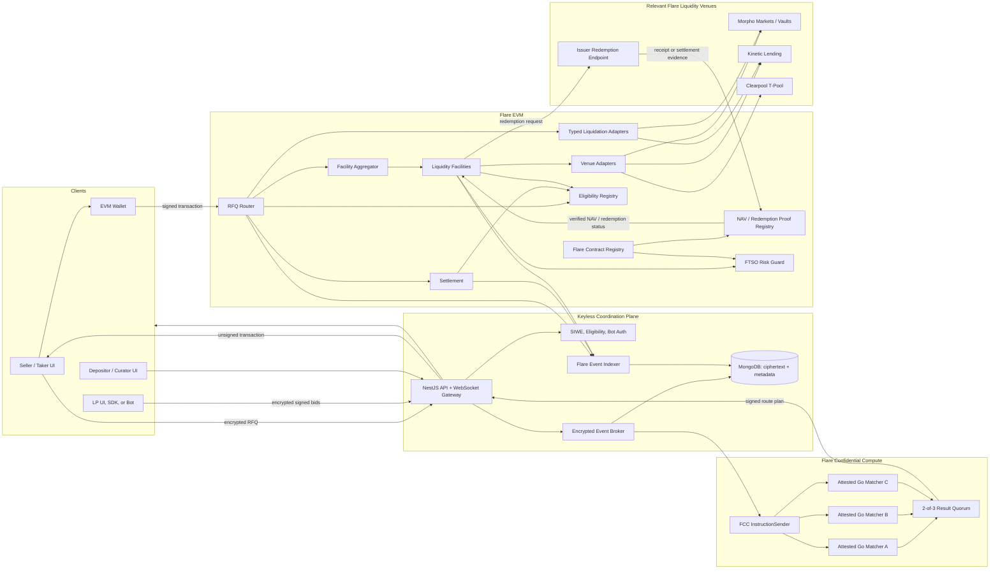
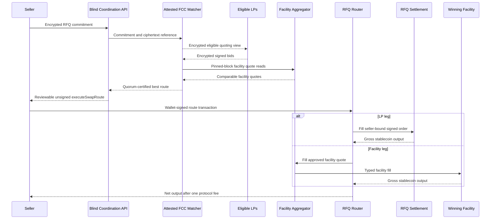
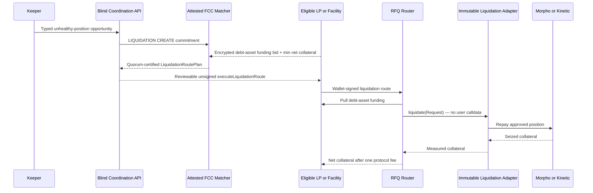
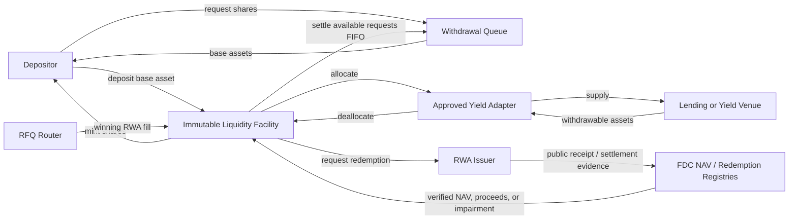

# Flare Confidential RFQ Desk System Design

## Architecture Overview

The Flare product is an issuer desk, not a single RFQ matcher. Confidential negotiation and deterministic route selection happen off-chain inside attested Flare Confidential Compute (FCC). Custody, eligibility, source registration, price guardrails, facility accounting, typed liquidation, and settlement stay on Flare. Public facility quotes compete with confidential signed LP bids through one router and one atomic transaction. Sealed-size RFQ is one route kind; standing liquidity, facility inventory, atomic lending-market liquidation, curator policy, and FDC-attested NAV redemption are first-class surfaces that share that router.

### Product surfaces

Every surface below is specified in this document and implemented as a desk route or typed contract entry. Official Morpho / Kinetic / FAsset venue adapters stay disabled until official Coston2 addresses exist; the types, FCC operations, and router entry points are not optional appendices.

| Surface | Actor | On-chain entry | Confidential / public split |
|---|---|---|---|
| Issuer swap / redeem | Seller / taker | `RFQRouter.executeSwapRoute` | Size and losing bids stay in FCC; settlement terms are public |
| Scheduled auction | Seller + LPs | same swap route after `MATCH FINALIZE` | Ciphertext in the blind relay; 2-of-3 `submitFccResult` |
| Standing bids | LP | consumed as a swap or liquidation-funding leg | Encrypted capacity plus EIP-712 order; explicitly public standing orders remain reusable within signed limits |
| Atomic liquidation | Keeper proposes; LP or facility funds | `RFQRouter.executeLiquidationRoute` | FCC `LIQUIDATION CREATE` / `FINALIZE`; result is a typed `LiquidationRoutePlan` (venue, market, position, adapter) — never arbitrary calldata |
| Liquidity facility | Depositor / LP | ERC-4626 `deposit`, queued `requestWithdraw`, `fill`, `fundLiquidation` | Quotes are inspectable on-chain (NAV, haircut, caps); facility funding bids for liquidation may be sealed |
| Curator / policy | Curator, guardian | adapter allowlists, haircut bounds, pause | No upgrade of deposited-fund logic; no arbitrary external calls |
| NAV / issuer redemption | Keeper books; anyone may submit FDC proof | `bookRedemption` / `settleRedemption` on `LiquidityFacility` | Issuer receipt attested via FDC; carrying value is `min(acquisitionCost, verifiedNav)` |

Selling seized collateral after a liquidation is a later inventory RFQ. It is not part of the liquidation transaction.

The expanded Flare product is authoritative while preserving the six-part settlement, coordination, facility, adapter, router, and aggregator shape.



### Repository shape

The Flare implementation lives alongside the existing application without changing its settlement boundary during initial development.

```text
apps/
  flare-web/            React 19 + TypeScript + Vite production SPA
  flare-api/            NestJS REST/WebSocket coordination and read API
packages/
  flare-core/           Pure canonical types, EIP-712 hashing, route math
  flare-sdk/            LP/curator TypeScript SDK and example bot primitives
  flare-contracts/      Generated ABIs, addresses, typed clients
contracts/flare/        Solidity contracts and Foundry tests/scripts
services/
  fcc-matcher/          Reproducible Go FCC extension
  indexer/              Flare event indexer and read-model projector
  keepers/              Liquidation, FDC, expiry, and redemption workers
infra/
  cloudflare/           Static frontend and edge configuration
  azure/                API, broker, indexer, keepers, monitoring
  gcp-confidential/     FCC Confidential Space images and attestation config
```

## Core Execution Flows

### Immediate execution

1. The seller selects an RWA, stablecoin, amount, and minimum output.
2. The client requests active standing liquidity. The coordination plane forwards the encrypted request to FCC and reads deadline-bound facility quotes from Flare.
3. FCC validates eligible standing bids, normalizes all sources to integer output amounts, and produces the best single or blended route.
4. Matching TEE results are reduced to a 2-of-3 signed quorum certificate in production.
5. The API assembles an unsigned `executeSwapRoute` transaction containing the bound seller and recipient, winning LP order(s), facility leg(s), route commitment, quorum certificate, active fee, deadline, and minimum net output.
6. The seller reviews the exact public settlement terms, signs in their wallet, and submits directly to Flare.
7. The router executes all legs, deducts the single configured protocol fee from aggregate output, enforces the seller's minimum against net output, and reverts the entire transaction on any failure or insufficiency.



### Scheduled confidential auction

1. The seller chooses `24 hours`, `1 week`, `1 month`, or `3 months`, declares whether deterministic early close is allowed, signs the RFQ commitment, and encrypts the terms to the FCC public key.
2. The blind relay stores ciphertext. FCC checks eligibility, derives the quoting view, and re-encrypts that view to each eligible LP client's registered encryption key; the relay distributes those opaque envelopes.
3. LPs create EIP-712 bids, sign them with an EOA, ERC-1271 wallet, or authorized delegated key, encrypt the signed payload, and submit it.
4. FCC validates and stores confidential auction state. Public UI metadata is limited to authorized fields, bid count, status, and expiry.
5. At the scheduled deadline, or at a policy-permitted early-close request, FCC snapshots facility quotes at a specified finalized Flare block and ranks them with eligible LP bids using deterministic tie-break rules. Early close never reveals or selects an individual sealed bid.
6. The seller receives an executable route. Non-winning bid plaintext is deleted according to retention policy and never placed on-chain.

### Atomic lending-market liquidation

Liquidation is a first-class route kind (`routeKind = LIQUIDATION`), not a post-swap helper. It inverts a seller swap: the winner supplies the venue's **debt** asset and receives **collateral**. The desk must not fold this into `executeSwapRoute` or a generic call bundle.

1. A permissionless detector or operator keeper identifies an eligible unhealthy Morpho or Kinetic position and publishes a typed liquidation opportunity; detection grants no custody or execution authority.
2. Eligible LPs and facilities submit confidential signed funding bids denominated in the venue's debt asset and specify their minimum net collateral output.
3. FCC validates the venue, market, position, eligibility, funding capacity, deadline, and policy, then selects the deterministic best route at a pinned decision block (`LIQUIDATION CREATE` then `LIQUIDATION FINALIZE`).
4. The result is an explicit `LiquidationRoutePlan` pairing one winning funding source with one governance-approved, venue-specific liquidation adapter. It contains no arbitrary target or calldata.
5. The bound winner or facility authorizes the router. The funding source supplies the debt asset, the adapter repays the approved unhealthy position, and the venue releases collateral to the router in the same transaction.
6. The router measures collateral by balance delta, deducts the single protocol fee, enforces the winner's minimum net collateral output, and transfers the remainder to the bound recipient. Any failed repayment, seizure, fee, or transfer reverts the whole route.
7. A later RFQ that sells previously seized collateral is an inventory-management flow and is not treated as atomic liquidation.



Official Coston2 Morpho / Kinetic addresses are not published. Adapters and the `/liquidations` desk remain typed and fail closed until those addresses are pinned. Interface-faithful fork tests exist; live venue execution does not.

### Facility fill and RWA redemption

1. A facility quote is computed from verified issuer NAV, curator haircut, exposure caps, available idle/withdrawable stablecoin, and FTSO guardrails.
2. During `fill`, the facility deallocates only the amount required from approved adapters, transfers stablecoin to settlement, receives the RWA, and books inventory atomically.
3. A keeper initiates issuer redemption outside the fill transaction and records the typed request identifier.
4. FDC attests the issuer's public receipt or supported chain event. Anyone may submit the proof.
5. The facility verifies the proof, accounts for received base assets, recognizes fees/loss, clears the receivable, and makes liquidity available to queued withdrawals.

### Facility deposit and withdrawal

1. Deposits mint shares from the facility's current accounted NAV under ERC-4626 rounding rules.
2. A withdrawal uses synchronous ERC-4626 behavior only when sufficient idle or immediately withdrawable liquidity exists.
3. Otherwise it creates an asynchronous request with locked shares and minimum acceptable assets.
4. Keepers deallocate from adapters and settle requests in deterministic queue order, subject to curator and governance safety limits.

## Smart Contract Architecture

### `RFQSettlement`

Responsibilities:

- hash and validate EIP-712 `Order` values;
- validate EOAs through ECDSA and contract wallets through ERC-1271;
- validate delegated signer registration, scope, expiry, and revocation;
- enforce order expiry, nonce/salt, pair cancellation epoch, filled amount, partial/FOK rules, and taker restrictions;
- require confidential one-off orders to bind the originating seller, authorized router, auction commitment, chain, and expiry while allowing explicitly public standing/limit orders to serve any eligible taker within signed limits;
- expose only typed router entry points for routed fills and reject an active router fee above the maker's signed fee limit;
- transfer ERC-20 inputs/outputs with balance-delta checks for explicitly supported token behavior;
- emit `OrderFilled`, `OrderCancelled`, `PairSaltAdvanced`, and signer events.

The contract does not rank bids, assess a second protocol fee, custody inventory, or call arbitrary targets.

### `RFQRouter`

Responsibilities:

- validate route kind, chain ID, verifying router, bound seller or winner, recipient, auction/order commitment, early-close policy, decision block, deadline, active fee, and FCC result quorum;
- require a recent decision block number/hash and reject route plans whose settlement window outlives the configured block-snapshot bound;
- expose separate typed `executeSwapRoute` and `executeLiquidationRoute` entry points rather than one generic external-call plan;
- execute an ordered set of LP and facility swap legs, or pair a single approved LP/facility funding source with a single approved liquidation adapter;
- enforce per-leg capacities and aggregate `minOutput`;
- deduct one aggregate TrustRFQ protocol fee, capped at 50 basis points and zero during pilot deployments, then enforce minimum output against the recipient's net amount;
- calculate output by observed balance delta rather than trusting return data;
- revert atomically if any source fails;
- emit one route event linking source fills to the same commitment.

The router uses allowlisted funding-source and liquidation-adapter registries plus typed calls. It never performs an unrestricted `delegatecall` or arbitrary external call supplied by a user. Confidential routes can execute only for their bound seller/winner and recipient; public standing orders still require current on-chain eligibility.

### `FacilityAggregator`

Responsibilities:

- register and enumerate approved facilities;
- pause or revoke a facility without seizing it;
- obtain comparable public quotes at a caller-specified block/deadline context;
- route typed fill calls to one or more facilities;
- expose quote failure reasons without causing unrelated facilities to fail discovery.

For matching, each FCC machine executes typed `eth_call` quote reads against the same finalized decision block and commits to that block hash and the resulting source snapshot. At settlement, a facility recomputes its live quote. The route may execute at the snapshot price or better; any deterioration below the signed per-leg or aggregate minimum reverts atomically. This avoids pretending that an old off-chain quote can force a facility to trade against changed on-chain liquidity.

### `LiquidityFacility`

Each facility is an isolated share vault with its own base asset, curator, approved RWA set, policy, and adapter allocations.

Accounting buckets:

- idle base asset;
- withdrawable and total assets reported by each adapter;
- acquired RWA inventory carried per lot at the lower of acquisition cost and the latest valid NAV;
- issuer-redemption receivables;
- realized loss and facility fees; and
- reserved assets/shares for pending withdrawals.

Critical methods:

```solidity
deposit(uint256 assets, address receiver)
requestWithdraw(uint256 shares, address receiver, address owner, uint256 minAssets)
cancelWithdraw(uint256 requestId)
settleWithdraw(uint256 requestId)
quote(address rwa, uint256 rwaAmount, uint64 decisionBlock)
fill(FacilityFill calldata fill)
allocate(address adapter, uint256 assets)
deallocate(address adapter, uint256 assets)
bookRedemption(RedemptionRequest calldata request)
settleRedemption(FdcProof calldata proof)
fundLiquidation(LiquidationFunding calldata funding)
```

Each acquired-RWA lot records acquisition cost and the latest accepted verified NAV. Its carrying value is `min(acquisitionCost, verifiedNavValue)`: verified impairment is recognized immediately, but an uncollected redemption premium cannot increase facility NAV or withdrawal value. Upside is realized only when issuer-redemption proceeds settle.



### Adapters

All yield-allocation adapters conform to:

```solidity
interface IFacilityAdapter {
    function asset() external view returns (address);
    function deposit(uint256 assets) external returns (uint256 deployed);
    function withdraw(uint256 assets, address receiver) external returns (uint256 returned);
    function totalAssets() external view returns (uint256);
    function maxWithdraw() external view returns (uint256);
}
```

Lending liquidation is deliberately separate from the yield-allocation interface:

```solidity
interface ILiquidationAdapter {
    struct Request {
        bytes32 marketId;
        address borrower;
        address debtAsset;
        address collateralAsset;
        uint256 maxRepayAssets;
        uint256 minCollateralOut;
        address recipient;
    }

    function liquidate(Request calldata request)
        external
        returns (uint256 repaidAssets, uint256 collateralOut);
}
```

Each immutable adapter maps `marketId` to governance-approved venue configuration fixed for that adapter version. The router cannot supply arbitrary venue addresses or calldata. A liquidation funding source is either a seller-bound LP order validated through `RFQSettlement` or a `LiquidityFacility` operating within separate liquidation market, asset, notional, and concentration caps.

Initial implementations:

- **Morpho adapter:** deposits a facility's matching base asset into a governance-approved market or curated vault, tracks shares/position assets, and caps withdrawal by current market liquidity and vault limits.
- **Kinetic adapter:** supplies the matching base asset to an approved lending market, values the interest-bearing position using the protocol exchange rate, and caps withdrawal by available cash and account constraints.
- **Clearpool T-Pool adapter:** only supports USDX facilities, converts between USDX and cUSDX through the verified T-Pool contract, includes claimable base-asset yield where safely measurable, and reports liquid withdrawal capacity.
- **Morpho liquidation adapter:** repays a configured unhealthy Morpho market position and returns seized collateral using the verified Flare deployment's typed interface and market parameters.
- **Kinetic liquidation adapter:** liquidates a configured unhealthy Kinetic borrow position, handles receipt-token seizure/redemption as required by the verified market interface, and returns measured underlying collateral.

Adapters never swap assets to make an incompatible base token fit. A facility with another base asset cannot use the USDX-only adapter without an explicit separately reviewed conversion design. Clearpool T-Pool is not a liquidation adapter.

### Oracle and proof modules

- `NavProofRegistry` verifies FDC Web2Json or supported EVM-transaction proofs before storing the newest monotonic `NavRecord` per asset.
- `RedemptionProofRegistry` verifies typed issuer-redemption receipts and prevents request/proof replay.
- `FtsoRiskGuard` reads FTSO through the network-specific Flare Contract Registry, normalizes decimals, checks timestamps, and applies stablecoin depeg and supported-market deviation limits.
- `EligibilityRegistry` stores policy-scoped wallet eligibility, expiry, issuer authority, and revocation state. Router, settlement, facilities, and liquidation flows check it at execution; permissioned-token transfer rules remain independent defense in depth.
- No quote is valid if its NAV or required guardrail is stale at the route decision block.

### Governance and safety

- `RFQRouter`, `RFQSettlement`, `FacilityAggregator`, `EligibilityRegistry`, and the proof/risk registries use transparent ERC-1967 proxies with explicit initialization, storage-layout checks, and upgrade simulation.
- Proxy administration and exposure-increasing configuration sit behind a multisig and timelock.
- Fund-holding `LiquidityFacility` instances and all yield/liquidation adapters are immutable, versioned deployments. A replacement requires new registration and voluntary asset migration; governance cannot upgrade deposited-fund logic in place.
- A guardian may pause contracts, pairs, facilities, adapters, or oracle paths but cannot upgrade, withdraw, or redirect user assets.
- Risk changes that increase exposure are delayed; emergency reductions and pauses may be immediate.
- Facility curator actions remain bounded by governance-set maxima.

## FCC Confidential Matching Design

### Extension operations

The Solidity `ConfidentialRFQInstructionSender` and Go extension share exact short `bytes32` operation identifiers:

| OP type | Command | Purpose |
|---|---|---|
| `RFQ` | `CREATE` | Validate and register an encrypted RFQ |
| `RFQ` | `CANCEL` | Mark a confidential RFQ cancelled |
| `BID` | `SUBMIT` | Validate a signed encrypted LP bid |
| `BID` | `STANDING` | Register or update encrypted standing liquidity |
| `MATCH` | `QUOTE` | Rank immediate sources |
| `MATCH` | `FINALIZE` | Close a scheduled auction and produce a route |
| `LIQUIDATION` | `CREATE` | Validate and register a typed unhealthy-position opportunity |
| `LIQUIDATION` | `FINALIZE` | Pair the best funding source with an approved liquidation adapter |

The constants, ABI/JSON schemas, and type-server registrations are generated or golden-tested together to prevent routing drift.

Each on-chain `OriginalMessage` contains only a fixed-schema payload commitment, encrypted-object reference, auction identifier, and expiry. It never contains RFQ or bid ciphertext, decryption material, credentials, or plaintext. A noncustodial dispatcher may pay the instruction fee, but its key can only invoke the fixed InstructionSender surface and has no authority over protocol funds. Sellers and LPs can dispatch their own commitments or use another dispatcher, preventing the relay from becoming an exclusive gatekeeper.

After the FCC instruction reaches an attested machine, the extension fetches the committed ciphertext from the blind relay over TLS, verifies its digest and authenticated metadata, and decrypts it inside the TEE. Finalization inputs that depend on Flare state are read independently by each machine from the same pinned decision block through typed RPC/ABI calls. The resulting source snapshot root is included in the signed result so different state observations cannot silently reach quorum.

### Input validation

The Go handler treats every instruction as hostile input:

- strict decoding with unknown-field rejection;
- bounded payload, bid count, and numeric widths;
- exact chain, contract, pair, token-decimal, and auction checks;
- EIP-712 signature and ERC-1271 verification against a pinned decision block;
- seller/auction/executor binding for confidential bids and signed-capacity enforcement for public standing bids;
- eligibility, delegated-key scope, early-close policy, and active router-fee-limit checks;
- typed liquidation venue, market, position, asset, health, and adapter-policy checks;
- monotonic state transitions and replay keys;
- deterministic sorting by output, then earliest submission sequence, then order hash;
- no network-fetched natural language or untyped data in the matching process.

### Encryption and storage

- Clients obtain the currently attested extension public key and code hash before encrypting.
- ECIES/HPKE-style envelopes include version, key ID, auction commitment, sender, nonce, and expiry as authenticated associated data.
- The Coston2 three-machine simulation uses one committed outer envelope with
  exactly three recipient entries. The same canonical plaintext is encrypted
  independently to each selected TEE public key; every ciphertext authenticates
  chain ID, extension ID, action ID, operation, expiry, and a common plaintext
  commitment. A handler accepts exactly one locally decryptable entry and
  verifies that commitment before processing. This avoids sharing plaintext or
  a content-encryption key between simulated machines.
- The outer envelope's `keccak256` is the InstructionSender
  `payloadCommitment`. Every handler verifies the common plaintext commitment
  before computing the canonical route hash, and the signed result remains
  bound to the same `actionId`. This prevents a sender from silently giving
  different instructions to different machines and relying on accidental
  quorum without changing the existing route-hash ABI.
- Eligible LP users and bots register rotatable encryption public keys bound to their authenticated institution. FCC re-encrypts only the minimum quoting view to those keys after eligibility checks; decryption occurs in the LP client, never in the relay/API.
- Secrets are delivered off-chain; encrypted payloads are not stored on-chain for long-term confidentiality.
- The relay stores ciphertext, delivery state, coarse size, timestamps, and commitments. Plaintext exists only in eligible client memory and TEE memory/state.
- Bid plaintext is retained only through the challenge/audit window configured for the environment, then securely discarded. Commitments and signed outcomes remain.

### Attestation and quorum

- The Go extension builds as a static reproducible binary with `SOURCE_DATE_EPOCH` pinned to the source commit.
- Production uses real Confidential Space attestation (`MODE=0`, no simulated TEE flags) and whitelisted code hashes.
- The InstructionSender routes to three registered TEE machines.
- A route is executable only when two machines return byte-identical result hashes with valid, domain-separated TEE signatures and acceptable attestations.
- A dissenting or unavailable machine is logged and excluded; fewer than two matching results fail closed.
- The current Coston2 milestone runs three independent local simulated machines
  through the official scaffold so the complete 2-of-3 delivery and result path
  can be exercised. It is always labeled simulated and keeps the mainnet gate
  closed. A later real-machine rollout may begin with reduced availability, but
  it cannot satisfy the production quorum gate until three attested machines
  are registered and failure-tested.

### Deterministic route result

```text
RouteResult {
  version
  routeKind
  chainId
  router
  rfqCommitment
  sellerOrWinner
  recipient
  policyDigest
  decisionBlock
  deadline
  sellToken
  buyToken
  sellAmount
  minNetOutput
  grossQuotedOutput
  protocolFeeBps
  netQuotedOutput
  legs[]
  tieBreakDigest
  sourceSnapshotRoot
}
```

For `routeKind = LIQUIDATION`, the canonical result additionally commits to venue, market ID, borrower or position ID, debt asset, collateral asset, maximum repay assets, funding source, and immutable liquidation adapter. For an early-close result, `policyDigest` proves that early close was enabled at creation and the decision block/time satisfied that policy.

The TEE signs a domain-separated hash of the encoded result, action ID, status, and chain ID. Contracts accept success status only.

## Data Models

### Coordination records

`AuctionRecord`

- `auctionId`, `commitment`, `creator`, `pairId`, `duration`, `opensAt`, `closesAt`, `earlyCloseAllowed`
- `status`: draft, open, matching, route-ready, submitted, settled, cancelled, expired, failed
- `ciphertextRef`, `teeKeyId`, `teeCodeHash`, `eligibilityPolicyId`
- `bidCount`, `decisionReason`, `decisionBlock`, `finalizedAt`, `routeResultHash`, `settlementTxHash`

`BidEnvelope`

- `auctionId`, `bidCommitment`, `lpId`, `ciphertext`, `receivedAt`, `deliveryStatus`
- no plaintext price, amount, signature, or bidder strategy in the coordination database

`StandingBidRecord`

- `commitment`, `lpId`, `pairId`, `capacityClass`, `validFrom`, `expiresAt`, `status`
- encrypted signed rule stored behind `ciphertextRef`

`RouteReadModel`

- public settlement fields derived from the finalized route and Flare events
- private seller fields returned only after authorization and never written to analytics logs

### On-chain structs

`Order`

- maker, authorized taker/seller, authorized executor/router, context commitment, sell/buy tokens, sell amount, minimum buy amount, filled amount policy, expiry, nonce, pair salt, order type, fill mode, protocol-fee limit
- confidential RFQ orders require nonzero taker, executor, and context commitment; explicitly public standing/limit orders may use an open taker subject to eligibility and signed capacity limits

`FacilityPolicy`

- RWA allowlist, yield-adapter allowlist, liquidation market/adapter allowlist, per-asset cap, aggregate cap, allocation cap, liquidation notional/concentration caps, haircut range, NAV max age, guardrail deviation, quote lifetime, redemption SLA

`InventoryLot`

- acquisition commitment, RWA, quantity, acquisition cost, latest verified NAV value, carrying value, impairment recognized, redemption request, realized proceeds
- carrying value is the lower of acquisition cost and latest valid NAV value; it never includes unrealized redemption upside

`NavRecord`

- asset, scaled NAV, decimals, source ID, as-of timestamp, proof round/request digest, accepted-at block

`WithdrawalRequest`

- request ID, owner, receiver, locked shares, minimum assets, created-at block, state, assets paid; cancellation restores locked shares and cannot block later FIFO requests

`RedemptionRequest`

- request ID, RWA, quantity, expected base amount, issuer reference commitment, opened-at, deadline, state, realized amount

`LiquidationOpportunity`

- opportunity commitment, venue, market ID, borrower/position ID, debt and collateral assets, maximum repay amount, health snapshot, decision deadline, eligibility policy

`LiquidationRoutePlan`

- chain ID, router, opportunity commitment, winner, recipient, decision block/hash, deadline, funding source, immutable liquidation adapter, maximum debt-asset repayment, minimum net collateral output, active protocol fee, quorum certificate

`EligibilityPolicy`

- policy ID, wallet, eligible roles, valid-from, expiry, status, issuer reference, revocation epoch; no KYC payload or personal information is stored on-chain

## API Design

### Authentication

- `GET /v1/auth/nonce?address=...`
- `POST /v1/auth/verify` with a domain-bound SIWE message and wallet signature
- `POST /v1/lp-credentials` for authorized administrators to issue scoped bot credentials
- `PUT /v1/lp-encryption-keys` to register or rotate an authenticated LP client's public encryption key
- Bot requests use credential ID, request timestamp, body digest signature, and optional mTLS identity.

### RFQ and auction API

- `POST /v1/rfqs` accepts an encrypted RFQ envelope and public commitment metadata.
- `GET /v1/rfqs` returns role-filtered auction read models with cursor pagination.
- `GET /v1/rfqs/:id` returns authorized status, bid count, freshness, and route state.
- `POST /v1/rfqs/:id/bids` accepts an encrypted signed bid envelope.
- `POST /v1/rfqs/:id/cancel` submits a signed cancellation intent.
- `POST /v1/rfqs/:id/finalize` requests matching when policy permits early close or the deadline has passed.
- Early finalization succeeds only when `earlyCloseAllowed` was committed at creation and always returns the deterministic best currently eligible route.
- `GET /v1/rfqs/:id/transaction` returns the reviewable unsigned route transaction only to the authorized seller.

WebSocket events use sequence numbers and resumable cursors:

- `rfq.opened`, `rfq.updated`, `bid.counted`, `rfq.matching`, `route.ready`, `tx.submitted`, `tx.confirmed`, `rfq.failed`.

No event contains losing-bid plaintext.

### Standing bid, facility, and dashboard API

- `POST|PUT|DELETE /v1/standing-bids`
- `GET /v1/facilities` and `GET /v1/facilities/:address`
- `POST /v1/facilities/:address/transaction/{deposit|withdraw|allocate|deallocate}` returns typed unsigned calls after authorization.
- `GET /v1/dashboard/{portfolio|activity|risk}` serves indexed on-chain read models.
- State-changing transactions are always signed in the user's wallet and submitted to Flare; the API never signs them.

### Liquidation API

- `GET /v1/liquidations` returns typed eligible opportunities with freshness, venue, market, debt/collateral pair, maximum repay amount, and decision status.
- `POST /v1/liquidations/:id/bids` accepts an encrypted signed LP or facility funding bid.
- `POST /v1/liquidations/:id/finalize` requests deterministic FCC selection after the deadline or policy-valid early close.
- `GET /v1/liquidations/:id/transaction` returns the typed unsigned `executeLiquidationRoute` transaction only to the bound winning LP/facility authority.
- Keepers may propose opportunities and progress public state, but cannot receive plaintext bids, select arbitrary targets, sign for a winner, or receive liquidation proceeds.

### Error model

Errors use a stable code and safe message:

```json
{
  "code": "RFQ_FCC_UNAVAILABLE",
  "message": "Confidential matching is temporarily unavailable.",
  "retryable": true,
  "requestId": "opaque-id"
}
```

Raw provider responses, signatures, proof bytes, ciphertext, and stack traces are excluded.

## Frontend Design

### Information architecture

- **Swap / Redeem (`/swap`):** immediate standing/facility route first; scheduled-auction creation if needed.
- **Auctions (`/auctions`):** filterable role-aware table for swap and liquidation opportunities with live freshness, status, expiry, best-authorized result, and actions.
- **Auction Detail:** summary strip, bids table appropriate to the viewer, swap or typed lending-position context, route status, and finalize/settle actions.
- **Standing Bids (`/standing-bids`):** instant/delayed tabs, bid and buy assets, spread/price rule, expiry, capacity, and pause/cancel controls. Resting capacity is a first-class inventory, not a form on the swap ticket.
- **Dashboard (`/dashboard`):** wallet activity, open orders, won liquidation routes, facility positions, pending withdrawals/redemptions, and transaction history.
- **Facility (`/facility`):** depositor shares, verified NAV, synchronous withdraw when idle liquidity exists, otherwise a queued request with locked shares and a minimum-assets bound.
- **Liquidations (`/liquidations`):** typed venue / market / position / max-repay / min-net-collateral review for `executeLiquidationRoute`. Keepers may list opportunities; the screen will not build a transaction from unverified addresses. Official venue adapters stay off until Coston2 addresses are pinned.
- **Curator (`/curator`):** approved adapter set, haircut range, guardian pause. Curators cannot upgrade contracts, withdraw user assets, or redirect settlement.

### Visual system

- Cool-gray page canvas and white primary surfaces.
- Thin cool-gray borders, restrained radii, and either border or subtle shadow per elevation level.
- One deep-green action token for execution; amber for bidding/pending, red for destructive/error, and blue for informational states.
- High-contrast sans-serif interface typography with tabular numerals for amounts, percentages, block/time data, and addresses.
- Consistent 4 px spacing grid, maximum 1280 px content width, and compact tables that become labeled cards on small screens.
- No gradients, glassmorphism, neon effects, decorative charts, or unrelated crypto imagery.

### Interaction model

- URL search parameters retain table filters, pagination, tabs, and selected auction where safe.
- Dialogs trap focus, close on Escape, and return focus to the trigger.
- Financial actions are never optimistic. The UI shows wallet signature, submission, confirmation, and final indexed state separately.
- Route review distinguishes gross output, source/venue costs, the single TrustRFQ protocol fee, and recipient net output; minimum-output labels always refer to the net amount.
- Forms retain values after validation, network, wallet, or submission errors.
- Skeletons preserve layout for tables/cards; errors provide inline recovery; empty states provide the correct next action.
- Confidential matching lasting more than two seconds exposes meaningful progress: encrypted, delivered to FCC, matching, quorum, route ready.
- Sensitive RFQ fields never appear in URLs, analytics events, browser logs, or unencrypted persistence.

## Technology Choices

| Layer | Choice | Rationale |
|---|---|---|
| Frontend | React 19, TypeScript, Vite, TanStack Query, wagmi, viem | Matches the existing frontend model and provides typed EVM wallet/RPC integration. |
| API | NestJS, TypeScript, REST + WebSocket | Structured modules, validation, OpenAPI, and realtime coordination. |
| Database | MongoDB | Flexible auction/read-model documents while ciphertext remains opaque. |
| Contracts | Solidity, Foundry, OpenZeppelin | Flare EVM compatibility plus fuzz/invariant testing and standard security primitives. |
| FCC | Go extension based on the FCC scaffold | Cross-machine reproducible static builds and strict, efficient matching logic. |
| Indexing | TypeScript event indexer with idempotent MongoDB projections | Keeps the backend reconstructible from Flare events. |
| Messaging | Redis-compatible broker/streams | Resumable encrypted delivery and backpressure without plaintext inspection. |
| Hosting | Cloudflare frontend, Azure coordination/keepers, GCP Confidential Space | Separates public delivery, ordinary operations, and attested confidential compute. |

## Design Decisions and Trade-offs

### Confidential matching instead of a public mempool auction

Public bids maximize transparency but leak LP strategy and invite copying. FCC protects pre-trade data while on-chain commitments, signed outcomes, and settlement preserve auditability. The remaining trust is the attested hardware/code supply chain, mitigated through reproducible builds and a 2-of-3 result quorum.

### Public facility quotes, confidential LP bids

Facilities derive quotes from on-chain state and are intentionally inspectable. LP strategy remains confidential. Treating both as identical would either leak LP bids or make facility accounting unnecessarily opaque.

### Immediate liquidity is pre-committed liquidity

The protocol does not invent a short auction tier. Immediate execution consumes already available standing/facility capacity; scheduled auctions use the approved long-duration choices. This keeps product language and settlement semantics unambiguous.

### Deterministic policy-bound early close

Allowing a seller to cherry-pick a sealed bid would conflict with best-price execution and leak auction strategy. Early close is therefore fixed in the creation commitment and runs the same deterministic matcher over all eligible sources at the pinned early-close decision context.

### Atomic route blending

Blending improves depth and price but increases call and failure complexity. A typed, allowlisted router and all-or-nothing balance-delta enforcement provide the benefit without accepting arbitrary-call risk.

### Liquidation as an explicit route kind

Atomic liquidation stays in `RFQRouter` so it reuses confidential source selection, quorum verification, replay protection, fee accounting, and all-or-nothing settlement. A dedicated `LiquidationRoutePlan` and immutable venue adapters keep its inverted funding/collateral semantics separate from ordinary seller swaps; a generic call bundle and a second privileged router were rejected.

### One aggregate router fee

Charging inside `RFQSettlement` would exempt facility and liquidation legs or double-charge blended routes. Every source returns gross measured output to the router, which deducts one bounded protocol fee and enforces the recipient's minimum against net output.

### Seller-bound confidential bids, reusable public limits

Flare has a public EVM mempool, so a revealed private quote must not be consumable by another wallet. Confidential orders bind seller, router, auction commitment, chain, and expiry. Explicit standing/limit liquidity remains reusable by any currently eligible taker within signed capacity and fee limits.

### Shared execution-time eligibility

Off-chain KYC and RFQ distribution checks are insufficient once signed calldata is public. A shared upgradeable `EligibilityRegistry` gives every fund-moving path the same policy snapshot, expiry, and revocation semantics; permissioned-token transfer rules remain a separate issuer-controlled check.

### Hybrid upgrades

Coordination-facing core and proof-policy modules need a governed patch path as FCC and Flare interfaces evolve, so router, settlement, aggregator, eligibility, and proof/risk registries use timelocked transparent proxies. Facilities and adapters hold long-lived positions and are immutable/versioned so a governance upgrade cannot replace deposited-fund logic; migrations are explicit and voluntary.

### Conservative acquired-RWA accounting

Marking inventory immediately to issuer NAV would let withdrawing shareholders realize an uncollected redemption premium. Facilities carry each lot at the lower of acquisition cost and verified NAV, recognize impairment immediately, and recognize upside only from settled redemption proceeds.

### FDC for NAV evidence, FTSO for guardrails

Issuer NAV and market price are different facts. FDC authenticates typed external issuer data; FTSO detects stale market conditions or depegs for supported feeds. Neither silently substitutes for the other.

### Narrow adapter set

Morpho/Mystic, Kinetic, and Clearpool T-Pool match the required lending/vault source categories. General DEX and perpetual integrations add unrelated attack surface and are excluded until a concrete facility requirement justifies them.

### Optional FAssets extension

FXRP mint/redeem can expand LP capital but introduces XRPL payments, rate limits, FDC proof progression, and additional UX. It remains behind an interface and release flag so it cannot block the RWA RFQ MVP.

## Requirements Coverage

| Requirement | Design coverage |
|---|---|
| FR-1 Immediate and scheduled execution | Immediate/scheduled flows, policy-bound deterministic early close, route result, Router atomicity |
| FR-2 Order and bid semantics | `RFQSettlement`, seller/context/executor binding, public standing limits, canonical EIP-712 types, delegated signer model |
| FR-3 Confidential coordination | FCC extension, blind relay, LP re-encryption, storage and quorum design |
| FR-4 Router and settlement | `RFQRouter`, `RFQSettlement`, one aggregate net-output fee, and typed-source controls |
| FR-5 Facilities | Aggregator, lower-of-cost-and-NAV inventory accounting, ERC-4626 plus queued withdrawals |
| FR-6 Venue adapters | Fixed adapter interface and three initial venue-specific implementations |
| FR-7 FDC and issuer NAV | NAV/redemption proof registries and asynchronous redemption flow |
| FR-8 FTSO guardrails | `FtsoRiskGuard`, registry resolution, freshness and deviation checks |
| FR-9 Optional FAssets | Isolated post-MVP extension and release gate |
| FR-10 Frontend | Information architecture, visual system, interaction and state model |
| FR-11 Authentication/compliance | SIWE, scoped bot auth, shared `EligibilityRegistry`, permissioned-token defense, safe API/log boundaries |
| FR-12 Operations/governance | Hybrid upgrades, multisig/timelock/guardian model, keepers, observability, deployment boundaries |
| FR-13 Atomic lending liquidation | Explicit `LiquidationRoutePlan`, LP/facility funding sources, immutable Morpho/Kinetic adapters, balance-delta fee/net-output enforcement |

## Non-Functional Requirements

### Security

- Checks-effects-interactions, reentrancy protection, SafeERC20, explicit rounding direction, and allowance minimization.
- EIP-712 golden vectors shared by TypeScript, Go, and Solidity tests.
- Confidential bid vectors prove seller, executor/router, auction commitment, chain, expiry, fee limit, and standing-order capacity binding; copied public-mempool calldata cannot redirect funds or consume another seller's private quote.
- Liquidation invariants cover approved-market binding, unhealthy-position validation, debt funding, seized-collateral balance deltas, single-fee assessment, net output, approval cleanup, and full rollback on every failure point.
- Proxy upgrades require timelock simulation and storage-layout evidence; immutable facility and adapter versions cannot be upgraded in place.
- No raw external data enters free-form processing; ABI/schema decoding precedes all use.
- Secret and dependency scanning in CI; production secrets in managed KMS/secret stores.
- CSP without unsafe inline scripts, strict transport security, rate limiting, WAF, and request-size bounds.
- Independent review of contracts, FCC result verification, encryption, governance, and deployment configuration.

### Reliability

- API and broker are horizontally restartable; ciphertext delivery is idempotent and cursor-based.
- Read models can be rebuilt from Flare events and immutable commitments.
- RPC reads use retry/backoff and at least two configured providers in production.
- Keeper actions are idempotent and permissionless where possible.
- Private matching fails closed; users are never silently downgraded to a public auction.

### Performance

- Support the initial 100-concurrent-auction, 50-bid-per-auction load profile.
- Bid ingestion p95 below 500 ms excluding client encryption.
- Deterministic ranking and quorum p95 below 2 seconds after the decision deadline under the pilot profile.
- Frontend p75 LCP <= 2.5 s, INP <= 200 ms, CLS <= 0.1.
- Tables use cursor pagination and virtualization only when measured row counts require it.

### Observability and privacy

- Metrics: auction lifecycle latency, encrypted delivery lag, TEE health/attestation/code hash, quorum agreement, early-close decisions, route failures, contract reverts, FDC age, FTSO age, eligibility denials, adapter liquidity, liquidation detection-to-settlement latency, liquidation rollback reasons, NAV impairment, withdrawal queue age, redemption SLA, and indexer lag.
- Logs use request/auction commitments and safe error codes, never plaintext bids or RFQs.
- Alerts cover mismatched TEE results, stale proofs/feeds, elevated route reverts, adapter liquidity loss, delayed redemptions, and indexer divergence.

## Deployment Boundaries

- Local mode may use mock system contracts and simulated FCC solely for developer feedback.
- Coston2 uses chain ID 114, network-specific Flare interfaces, mock RWA assets, interface-faithful liquidation venues where live contracts are unavailable, and real FCC/FDC/FTSO where available.
- Mainnet uses chain ID 14, verified production assets and Morpho/Kinetic/Clearpool interfaces, `evmVersion = "cancun"`, real attestation only, 2-of-3 TEE quorum, conservative swap/liquidation caps, an initialized eligibility policy, and published proxy, implementation, immutable facility, and adapter addresses.
- Clearpool T-Pool is deployed only as a USDX yield adapter. Morpho and Kinetic liquidation support is enabled per verified market only after pinned-fork conformance and failure testing.
- All state-changing deploy or governance actions require an explicit reviewed transaction executed from the correct multisig or deployer environment.
