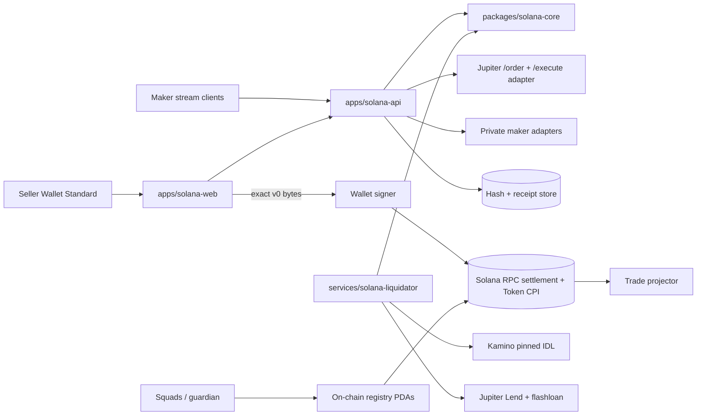
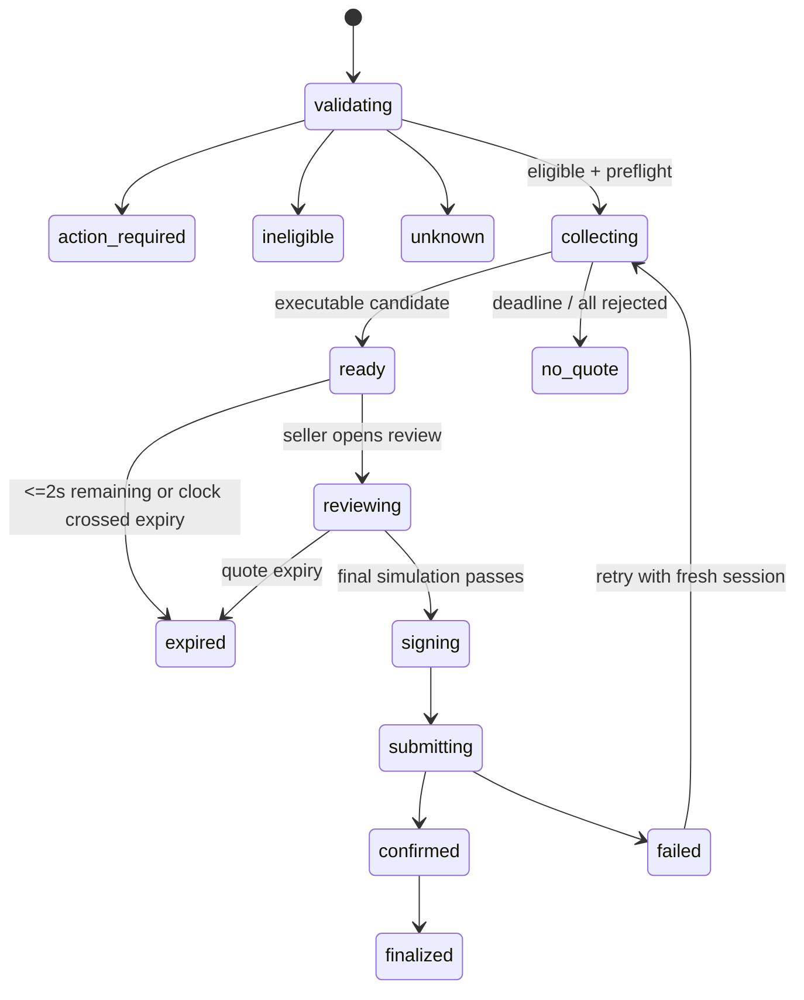

# Design Dossier

## Design stance

Katon is a private quote coordinator around a public Solana settlement boundary. The seller chooses an issuer-verified stock, exact input, and native stablecoin. Independent source adapters produce executable candidates; a pure integer ranker chooses one. The API cannot sign or mutate funds. The winner's wallet signs an exact v0 transaction after a final simulation.

The product deliberately separates issuer policy from route mechanics. xStocks and Ondo each get an adapter implementing the same preflight contract, but no generic “SPL stock” path exists. A Token-2022 mint is accepted only when the registry fingerprint, authorities, transfer hook, and account list match the recorded manifest.

## System boundaries



The browser never receives losing-maker payloads. The API retains a transaction payload only until its quote expires, and stores only hashes, terms, signatures, audit metadata, and receipts beyond that point. The settlement program never owns inventory.

## Repository shape

```text
apps/solana-web/                 seller, maker, and operator React/Vite SPA
apps/solana-api/                 NestJS-compatible HTTP/SSE coordination API
packages/solana-core/             pure integer math, types, registry, ranking
packages/solana-sdk/              kit-compatible API, wallet, and transaction helpers
contracts/solana-rfq/             Anchor settlement program and IDL boundary
services/solana-liquidator/       independent liquidation solver and manifests
fixtures/solana/                  issuer, extension, route, and fork fixtures
scripts/                          local manifests and release checks
```

## Core data model

All amounts are decimal strings at API boundaries and `bigint` inside core logic. A `QuoteCandidate` contains source/router, gross output, Katon fee, venue fee, net output, reference price/deviation, simulation result, v0 transaction bytes/hash, quote ID, and expiry. A `SanitizedAuditRow` includes only source class, net amount, timestamp, and structured rejection code.

The asset registry stores mint, token program, issuer, ticker/underlying, decimals, extension fingerprint, expected hook, pausable/scaled/fee capabilities, stable outputs, reference/session state, and enablement. Registry snapshots are versioned and signed; any mismatch yields `unknown`.

## Quote sprint state machine



Eligibility and on-chain preflight run before any maker receives the quote. Collection uses `Promise.allSettled` with a three-second deadline and records source health. The ranker is pure and deterministic:

1. remove candidates with structured rejection or failed simulation;
2. require output mint equality and exact input equality;
3. require `expiry - now > 2s`;
4. sort by net output descending, remaining validity descending, rolling reliability descending, source ID ascending.

No candidate is silently repriced. If the best candidate loses validity during review, the API returns `expired` and the UI requests a fresh session.

## Transaction and settlement design

### Private maker route

The API asks the program client to build a v0 transaction containing the exact quote terms and all transfer-hook accounts. It returns a payload hash and transaction bytes to the seller. The seller's wallet signs those exact bytes. On execute, the API verifies the signed message hash equals the issued winner hash, verifies the wallet identity, and forwards the transaction to a trusted RPC sender. A maker signature is embedded as instruction data; no browser mutation is allowed after signing.

The Anchor instruction `settle_private_quote`:

- checks the seller and allowlisted maker signatures;
- derives `FillReceipt` from `[b"fill", maker, quote_id]` and rejects an existing receipt;
- checks `expiry <= now + 30s`, non-zero amounts, mint/program/registry equality, and minimums;
- invokes only Token or Token-2022 `transfer_checked`, including validated hook accounts;
- measures seller/maker/fee-recipient token-account deltas and rejects unexpected fees or short delivery;
- computes `floor(gross * fee_bps / 10_000)` and rejects `fee_bps > 25`;
- emits `PrivateQuoteFilled` with IDs and atomic amounts;
- permits a permissionless close only after expiry + one hour, subject to rent-payer rules.

The registry PDAs are read-only in settlement and are changed only by 2-of-3 Squads after a 24-hour delay. A separate guardian can pause enabled assets/programs but cannot upgrade or transfer funds.

### Jupiter route

The Jupiter adapter calls `/order`, records the returned router, route fees, expiry, and transaction bytes, and never deserializes/rebuilds a JupiterZ managed-signing transaction. `/execute` is called only after the wallet has signed the unchanged payload. Katon fee is zero for this branch.

## API contract

HTTP handlers are thin and call pure core services. SSE events are sanitized. Request validation rejects numeric JSON values for monetary fields, unknown fields, output mints other than native USDC/USDT, and input amounts that do not parse exactly to the registered decimals.

```ts
type QuoteSessionRequest = {
  wallet: string;
  inputMint: string;
  outputMint: string;
  inputAmountAtomic: string;
};

type ExecuteRequest = {
  wallet: string;
  signedTransactionBase64: string;
};
```

The server has no keypair. It uses a sender interface for the final transaction and a persistence interface for hashes/receipts. In-memory implementations are suitable for local tests; production adapters use Mongo/Redis and a trusted RPC/SWQoS/Jito sender.

## Issuer and Token-2022 adapters

`IssuerAdapter.preflight` receives a validated mint account and wallet. `xstocks` requires the recorded metadata pointer, scaled UI amount, pausable configuration, and issuer authority fingerprint. `ondo` additionally requires its issuer program/JIT capability fingerprint and refuses generic route payloads. Both adapters reject permanent delegates, confidential/unknown extensions, paused transfers, changed hook programs, and insufficient post-fee balance deltas. DBC is not a secondary route.

## Liquidation solver

The solver owns no API signing path. At startup it resolves Kamino and Jupiter Lend addresses/IDLs, compares runtime bytecode and upgrade authorities to a signed manifest, discovers reserves/vaults/oracles, and passes the immutable manifest-plus-market startup gate. It remains dormant on any mismatch, unavailable discovery, or empty reviewed market set. It polls only native-USDC-debt positions with registry-enabled stock collateral and asks each lender to build its authoritative liquidation instruction.

An opportunity lock covers detection through send. Funding is Jupiter flashloan first; a prefunded wallet can cover at most 2,000 USDC. The route must include lender liquidation, stock unwind via private RFQ or instruction-buildable Jupiter/AMM route, repayment, fee/profit transfer, and zero-residual checks in one atomic transaction. JupiterZ or Ondo managed transactions cannot be embedded. `simulateTransaction` runs immediately before signing/submission. Three landing failures, residual stock >1 minute, >25 bps adverse execution, stale oracle/policy, or any manifest mismatch trips a circuit breaker.

## Frontend design

The seller ticket is the dominant bordered surface on a warm-monochrome canvas. A secondary panel carries issuer/reference/session context and best-execution details; it stacks below the ticket on mobile. Values in the ticket and review are detailed, never abbreviated or scientific, with raw-precision copy buttons. Activity tables can use compact formatting.

`/trade` uses a real form with a decimal text input (`inputmode="decimal"`), visible labels, balance shortcut buttons, issuer badge, session state, output radio group, and an explicit submit button. A result card exposes an audit drawer implemented as a real button/dialog, not a click handler on a `div`. All controls have focus rings and 44px touch targets. Loading, no-quote, error, expired, offline, and success states are explicit.

Wallet UI uses Wallet Standard discovery with disconnected/connecting/locked/connected/wrong-cluster states. The review panel names the settlement program, counterparty/venue, fee payer, network fee estimate, minimum receive, expiry, and simulation result. A Solscan link is shown only after a signature exists and is cluster-aware.

## Verification architecture

- Core Vitest tests pin integer rounding, ranking, fee cap, extension fingerprints, stale policy, audit redaction, and hash binding.
- Anchor tests cover classic Token and Token-2022 happy paths, hooks/fees/pauses/delegates/memos, wrong signers/mints/programs, expiry, replay, duplicate accounts, overflow, CPI attempts, and balance deltas.
- Surfpool tests fork real xStocks/Ondo, Jupiter/Raydium routes, Kamino obligations, Jupiter Lend vaults, ALTs, and paused/stale scenarios. Every agent-run command is prefixed `NO_DNA=1`.
- Adapter contract tests use official fixtures and malformed/expired/managed-signing responses.
- Browser tests cover Wallet Standard states, keyboard/reduced motion, audit drawer, exact formatting, 375/768/1280 layouts, and all quote/transaction states.
- Solver tests cover flashloan shortage, prefunded fallback, race loss, stale health, unwind failure, residual inventory, RPC disagreement, adverse execution, and breakers.

## Operational rollout

Local LiteSVM/Surfpool and mock devnet precede mainnet. Shadow quote collection and solver observation run for seven consecutive days with no submission. At least 20 representative opportunities and 95% prediction-to-simulation agreement are required. A human/multisig action enables execution. Caps rise only through reviewed config; no automatic escalation.

## Open launch gates

Legal/compliance approval for non-US access, signed asset/venue manifests, independent security audit, reproducible program and IDL hashes, production RPC/SWQoS/Jito, concrete Kamino/Jupiter stock markets, and a completed wallet QA artifact review remain explicit gates. The code in this worktree intentionally fails closed when those gates are absent.
