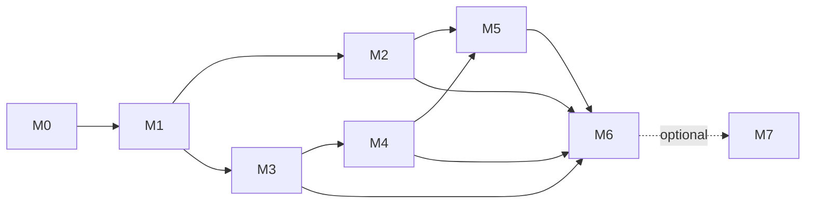

# Flare Confidential RFQ DEX Implementation Plan

## Planning Principles

- Build vertical, testable settlement slices before adding capital-efficiency features.
- Keep the existing Stellar application and its security boundary intact.
- Treat FCC, signatures, router atomicity, facility accounting, FDC proofs, and governance as security-critical paths.
- Treat atomic lending liquidation as a separate typed route with venue-specific adapters; a post-seizure resale is not a substitute.
- Ship the full production frontend as part of the core product, not as post-contract polish.
- Keep FAssets behind an optional post-MVP milestone that cannot block the DEX.
- Verify external protocol addresses and interfaces at deployment time; never encode research results as permanent addresses.

## Current Status

- **Phase:** Phase 7 Check Implementation (2026-08-13 independent re-verify). The feature is **not** complete. Production milestones M0–M5 remain `[ ]` (**0/6**). Local-complete milestones are **1/6 (M0 only)**; M1–M5 are **partial**. Do not start another implementer `/goal` that only re-runs suites twice.
- **Task state:** local slices exist for workspace, settlement/router/eligibility, blind relay + simulated matcher, facility/aggregator, FDC/FTSO seams, **Morpho Vault V2-compatible, Kinetic Compound-style, and Clearpool T-Pool yield adapters**, plus local Morpho liquidation and ABI-correct Kinetic `liquidateBorrow`/cToken-redemption routing. Typed liquidation route wiring, the role-shell UI, indexer projector, keepers, prior T5.8 headed MetaMask evidence, and optional FAssets mint/redeem preparation are also local. Production-successful verified-venue forks, real FCC attestation, paid FDC credentials, and hybrid upgrade/deployment handoff remain external or release work.
- **Latest venue-fork continuation evidence (2026-08-13, option 1):** `forge test --offline --root contracts/flare` passes **123**, fails **0**, and skips **29** opt-in `VenueMainnetFork` cases. Checked plans pin Flare mainnet block **65,078,017** for Kinetic (**18** cases: 8 common yield/binding cases, 7 real-position liquidation/rollback cases, official binding, caller rejection, and fresh-adapter allowlist rejection) and Clearpool (**10** cases); Morpho has only an official core/factory binding probe because no authoritative live Flare vault has been selected. Kinetic's strict current-state case proves that a fresh adapter is rejected and state rolls back; positive liquidation cases separately impersonate the real verifier owner only to call the real owner-only `allow(adapter)` method. That setup models a deployment prerequisite and is not current mainnet-eligibility evidence; it uses neither `vm.store` nor `vm.etch`. The exact-result runner now scopes discovery to `VenueMainnetForkTest`, passes literal validated test names, and uses Foundry `--offline` alongside the explicit fork URL. Fork-runner tests pass **18/18**, both Flare typechecks pass, and the matcher core passes; Go HTTP normal/race suites remain listener-blocked while `go vet` passes. A measured in-process simulated relay finalization passed in **1.823 ms** for the pinned scenario with the expected route hash and real-mode fail-closed behavior. Neither venue plan produced a manifest: installed Forge 1.5.1 panics in macOS `SCDynamicStore` initialization before receiving an RPC response, including elevated execution, and the isolated Forge 1.7.1 download attempt was DNS-blocked. HTTP and Playwright acceptance remain open because loopback `listen` and the Playwright daemon cache both fail with `EPERM` here.
- **Current evidence (re-verified 2026-08-13 after adapter/curator/FAssets local close):** fresh local checks pass twice: **277** TypeScript tests across 39 files, Go matcher unit tests (`go test -count=1 ./...` under `services/fcc-matcher`), Foundry **105** tests across 16 suites (`cd contracts/flare && forge test --offline`, `via_ir=true`), and Soroban **6** tests. New local coverage: `contracts/flare/src/adapters/*`, `VenueAdapters.t.sol` (6), `TypedLiquidationRoute` Morpho+Kinetic shipped-adapter paths, `curatorAdapterSummary` / `DEFAULT_CURATOR_ADAPTERS`, `FAssetsRail.prepareRedeem`. Admin-owned Coston2 smoke (`FLARE_DEPLOYMENT_MANIFEST=contracts/flare/deployments/coston2.json npm run smoke:flare:coston2`) PASS twice: `chainId=114`, router `0x593095709e16275cc0b8aa0ef908fd13d693c36c`, settlement `0x6dc51b3ef4eea9d7b0609381491e00abf3720674`, eligibilityRegistry `0x040b49f3408267fbf95f048e6bb7a5b09e830fac`, eligibilityPolicyDelay=172800. Bundle budget: `npm run check:flare:web-performance` PASS (`jsBytes=258084`, `cssBytes=6970`). Default `npm run smoke:flare:coston2` still prefers `coston2-proxy-candidate.json` when that file exists; that candidate is not this MVP claim. No production-FCC/venue/multisig claim. **SC criteria and production readiness are not claimed closed**.
- **Coston2 facility evidence:** the direct non-production manifest records a freshly deployed LiquidityFacility, successful router registration/configuration, and a typed facility-backed swap settling 1 RWA for 1 gross USDX with a 0.995 USDX minimum-net invariant. This is mock/testnet evidence only and is not external venue evidence.
- **Scope boundary:** Kinetic yield and liquidation now follow the documented Compound-style market/comptroller ABI and have opt-in pinned-fork cases against documented Flare deployments, including creation of a live-protocol unhealthy position, close factor, minimum-output rollback, allowance cleanup, recipient rejection, and redemption-failure atomic rollback. Clearpool has a pinned T-Pool plan and common business-operation cases. Morpho yield follows Vault V2 share semantics but has no authoritative live Flare vault selected; its operation fork plan therefore remains unavailable. No successful mainnet-fork run, deployed Morpho round trip, or executed real lending liquidation is claimed. The FCC path remains unavailable until real dedicated extension + attestation evidence is supplied. Credentialed live FDC proof retrieval/submission, venue fork SC-16, extension-specific signing UX, managed Mongo/Redis operations, external review, and release-candidate/mainnet promotion remain open.

## Implementation Tracking — 2026-08-13 (reconciled after Check Implementation)

Status legend: **done (local)** = implemented with fresh automated evidence in this
worktree, not production-closed; **partial** = local seam exists with a named
external/production gate; **blocked** = cannot progress without external
credentials, network state, or human authorization; **not started** = no local
implementation claimed. Production task checkboxes in the Task Breakdown remain
open until SC production criteria are met.

| Status | Scope | Evidence / next step |
|---|---|---|
| done (local) | Workspace scaffold, Node/Rust/Go/Foundry pins, CI skeleton with Flare builds and Go race/vet gates | `package.json`, `tsconfig.flare.json`, `rust-toolchain.toml`, `go.work`, `.github/workflows/flare.yml` |
| done (local) | Deterministic SBOM + source secret scan | `npm run sbom:flare`, `npm run check:flare:secrets` |
| done (local) | Coston2 core deployment manifest and read-only RPC smoke for bytecode, ownership, policy, and Settlement wiring | `contracts/flare/deployments/coston2.json`, `tools/deploy-flare-coston2.mjs`, `tools/smoke-flare-coston2.mjs`, `src/flare-contracts.smoke.test.ts` |
| done (local) | Canonical TS boundary, route ranking, exact decimals, network/runtime validation, strict FTSO policy/reference checks, and positive NAV proofs | `src/flare-core.canonical.test.ts`, `src/flare-core.network.test.ts`, `src/flare-core.runtime.test.ts`, `src/flare-core.oracle.test.ts` |
| done (local) | Facility inventory lot carrying at lower of acquisition cost and verified NAV; selected-lot redemption; optional NavProofRegistry.latest for quotes/fills | `LiquidityFacility.sol` lot fields + `setNavProofRegistry`/`refreshInventoryLotNav`; `testVerifiedNavRegistryBlocksOwnerMarkAndDrivesQuotes`; core facility tests |
| done (local) | Solidity settlement/router/source allowlist, deterministic quorum, proof, strict feed, enum, risk, and instruction-reference seams | Typed swap/liquidation entry points, seller/winner/executor binding, shared eligibility on fund-moving fills, fee-cap vs router, settlement reentrancy, remainingFillable/protocolFeeOn conservation, and typed Settlement composition are local (**97** Foundry tests); production adapters remain |
| done (local) | Blind envelope, SIWE nonce/session verification, relay eligibility/idempotency, LP key lifecycle, strict Go/TS matcher metadata validation | `packages/flare-core/src/auth.ts`, `packages/flare-core/src/matcher.ts`, `apps/flare-api/src/blindRelay.ts`, unit/API/Go tests |
| done (local) | Facility ledger with owner-share locking/FIFO exits, adapter conformance, idempotent projector/keeper | facility/adapters/operations unit suites |
| done (local) | Route commitment replay, decision-block age/hash policy, typed source calls, and router reentrancy guard | `RFQRouter.sol` + tests |
| done (local) | Solidity facility share/withdrawal/redemption baseline, standard share views/exits, and router composition | `LiquidityFacility.sol` + tests |
| done (local) | Facility haircut, inventory, total-exposure, adapter, and deterministic withdrawal-order policies | `LiquidityFacility.sol` + tests |
| done (local) | Facility enumeration/active quote discovery and deployment-time Contract Registry resolver | `FacilityAggregator.sol`, `registry.ts` |
| done (local) | Typed redemption-proof registry with source, owner, time, binding, amount, and replay checks | `redemption.ts` + tests |
| done (local) | Relay payload/eligibility/rate limits, deadline-safe scheduled auction lifecycle, public safe errors, resumable role-scoped cursor, bounded HTTP pagination, and actionable API status codes | API + SDK client tests |
| done (local) | Solidity delegated signer bounds/revocation, partial/FOK fills, expiry, cancellation, fee-limit, and typed Router-source paths | Settlement validates signed fee cap without a second fee, aggregates delegated notional, and binds confidential `executor`/`contextCommitment`; remainingFillable + protocolFeeOn handler-style fuzz/malicious-wallet matrix is local (`SettlementRouterInvariant.t.sol`) |
| done (local) | Shared execution-time eligibility boundary | Direct `fill` reverts; typed Router swap/liquidation, `fillWithEligibility` (public standing only), and facility fills consume eligibility; policy replacement timelocked; production matrix/ops remain |
| partial | Typed atomic lending-liquidation route and venue adapters | Typed `executeLiquidationRoute`, Vault V2-compatible Morpho yield, Compound-style Kinetic yield/liquidation, Clearpool T-Pool yield, and local Morpho liquidation tests exist. Kinetic has 18 pinned fork cases and Clearpool has 10; **a successful fork run, an authoritative live Morpho vault, and real-execution SC-16 evidence** remain. |
| partial | Hybrid upgrade/deployment wiring | Transparent proxy, two-day timelock, layout smoke local; **multisig handoff, immutable facility/adapter version registration, migration execution, independent review** remain |
| done (local) | Network-specific FTSO feed-ID resolution + live Coston2 registry/FTSO/FDC smoke seams | `registry.ts`, `smoke:flare:live-data`, owner-controlled Coston2 NAV proof sequence |
| done (local) | Cross-language EIP-712 order vector, strict matcher payload decoding, and auction/bid metadata validation | Go matcher + TS vectors |
| done (local) | Finality-aware deterministic event projection, SDK route input validation, and decimal-safe standing-bid bounds | indexer projector + SDK tests |
| done (local) | Public event catalog + shared decoder ABI | `packages/flare-core/src/events.ts`, `src/flare-events.test.ts` |
| done (local) | Typed frontend read-model/transaction states, accessible shell status wiring, exact asset/amount input helpers, route-wide axe + responsive/keyboard/reduced-motion browser checks | `apps/flare-web`, headed E2E |
| done (local) | Local API/read-model/quote transport, SIWE mutation boundary, durable JSON + Mongo seams, RPC-backed index confirmation | API + compose evidence |
| partial | Browser-extension UX and managed production operations | Local Mongo/Redis, keepers, FCC `/info` fail-closed checks, venue interface harness present; **extension fixtures, managed ops, real FCC attestation, paid FDC credentials, deployment secrets** remain |
| blocked | Mainnet pilot, real FCC 2-of-3 attestation, successful venue fork validation, external security review | Plans and block are pinned, but this macOS sandbox cannot initialize Forge networking or bind loopback listeners; verified fork manifests and external approvals remain required. |

## Task Reconciliation — 2026-08-13 (post Check Implementation)

`done (local)` means the local slice is implemented and covered by a fresh check;
`partial` means the local seam exists but its external or production dependency
is still open; `blocked` means external authorization is required; `not started`
means no local implementation is being claimed.

| Tasks | Status | Local completion / remaining gate |
|---|---|---|
| T0.1 | done (local) | Monorepo packages, packages discovery, preserved Stellar suite. |
| T0.2 | done (local) | Pins, CI, SBOM, secret scan, Go race/vet; final release credentials remain external. |
| T0.3 | done (local) | Typed local/Coston2/mainnet config, wrong-network fail-closed; live registry **governance** remains external. |
| T1.1, T1.2 | done (local) | TS/Go/Solidity EIP-712 with executor+contextCommitment, ERC-1271, delegated aggregate cap, partial-fill fuzz, fee-on-transfer/false-token rollback, remainingFillable conservation, high-s / reentrant-token / reverting ERC-1271 / wrong-executor matrix local. Production-scale nightly fuzz is not claimed. |
| T1.3 | done (local) / partial | Typed swap path, composition, one aggregate fee, fee-cap vs router, settlement reentrancy, rollback, and protocolFeeOn conservation local. Open-taker standing (`taker==0`) is now an executable route leg. Production venue composition is not claimed. |
| T1.4 | partial | SDK wallet, Coston2 mock swap, headed browser E2E local; extension signing UX and production user flow remain. |
| T1.5 | done (local) / partial | Direct fill locked; eligibility on typed Router/Settlement/Facility paths + policy timelock local; production ops matrix remain. |
| T2.1–T2.5 | partial | SIWE, blind relay with persisted bids, sim finalize → `hashSwapRoute`, plaintext POST fail-closed, LP keys, Go matcher 2-of-3, InstructionSender seam, scheduled lifecycle local; **real FCC attestation**, production broker, full-stack confidential E2E remain. |
| T3.1–T3.5 | partial | Aggregator, shares, queue, haircuts, router composition, redemption seams, lower-of-cost/NAV lots, adapter live NAV, pull-on-fill, `fundLiquidation`, registry-mode settle local; complete ERC-4626/7540 policy depth, fork/invariant coverage remain. |
| T4.1–T4.2 | partial (stronger) | Typed proof/FTSO guards + live Coston2 FTSO/FDC smokes + owner-controlled NAV proof sequence evidenced; **production FDC credentials/policies** remain. |
| T4.3–T4.6 | partial (stronger) | `BaseYieldAdapter`, Vault V2-compatible Morpho yield, Compound-style Kinetic yield, Clearpool T-Pool yield, expanded edge cases, and pinned plans for Kinetic/Clearpool exist. The local Foundry run skipped all 29 fork cases; **an authoritative Morpho vault and successful fork evidence** remain. |
| T4.7–T4.8 | partial (stronger) | Morpho/Kinetic liquidation adapters + typed route tests are local. Kinetic now uses the real Compound-style liquidation and collateral-redemption ABI and has seven real-position fork cases; **successful pinned execution, Morpho live semantics, and SC-16** remain. |
| T5.1–T5.6 | partial | Role shell (7 routes), demo quote, API workflows, headed injected E2E, projector→read-model→UI opportunities, and curator summary from `DEFAULT_CURATOR_ADAPTERS` (`0 enabled` until governance) local. Not production SC-10. |
| T5.7 | partial | Axe + responsive + keyboard/reduced-motion + local bundle budgets **done (local)**; screen-reader, visual baselines, production Lighthouse/Web Vitals remain. |
| T5.8 | done (local) | Prior headed evidence retained; **dAppwright re-run skipped by operator**. Injected `test:e2e:flare*` is not this path. |
| T6.1 | done (local) | Public event catalog + decoder ABI + inventory-lot events. |
| T6.2–T6.4 | partial | Dual Mongo/Redis projector, keeper leases, compose stack, SBOM, short soak/load local; **managed dashboards, failover, 24h soak, production deploy** remain. |
| T6.5–T6.7 | blocked | Coston2 RC, external review, real FCC, multisig, mainnet pilot. |
| T7.1–T7.2 | partial | Optional `FAssetsRail` mint + redeem preparation (disabled-by-default, never signs) local; Core Vault orchestration UX and live registry wiring remain. |
| T7.3 | not started | FXRP-backed LP funding UX. |

### Doc reconciliation — 2026-08-13 (local adapters + curator + FAssets; external 2-fail)

Operator-directed pass: tackle all remaining open/partial **local** items; **skip only T5.8 dAppwright re-run**.

**Local code shipped this pass (not production SC):**
- Solidity adapters under `contracts/flare/src/adapters/` (`BaseYieldAdapter`, Morpho/Kinetic/Clearpool yield, Morpho/Kinetic liquidation) + interface-faithful mocks.
- Foundry `VenueAdapters.t.sol` (6) and `TypedLiquidationRoute` routes through **shipped Morpho + Kinetic** adapters.
- Curator console reads `curatorAdapterSummary(DEFAULT_CURATOR_ADAPTERS)` (all disabled until governance).
- `FAssetsRail.prepareRedeem` + unit tests (disabled-by-default; never signs/submits).
- Evidence: `npm test` **277/277**; `forge test --offline` **105**; Go matcher pass; Soroban **6/6**; admin Coston2 smoke PASS ×2; `check:flare:web-performance` PASS.

**External gates — two attempts each, fail-closed / documented (not local code defects):**
| Gate | Attempt result | Blocker |
|---|---|---|
| Venue verify/conformance | `VENUE_MANIFEST_REQUIRED` / `VENUE_CONFORMANCE_MANIFEST_REQUIRED` ×2 | No operator-supplied verified venue manifest |
| FCC registry smoke | `fcc-boundary=DEDICATED_EXTENSION_REQUIRED` ×2 | InstructionSender candidate unconfigured; dedicated extension not provisioned |
| FDC verifier smoke | `BLOCKED FLARE_FDC_API_KEY is required` ×2 | Paid/credentialed FDC API key absent |
| Production Lighthouse | not run | No production URL; `npx lighthouse` install hang; local bundle budget only |
| Screen-reader / visual baselines | not run | Operator-manual / approved visual refs not available in this loop |

**Untackleable without external inputs (after ≥2 attempts):** T2.4 real FCC attestation; T4 fork SC-16 verified venues; T4.1–T4.2 paid FDC; T5.7 screen-reader/visual/production Lighthouse; T6.4–T6.7 managed ops/RC/review/mainnet; T7.3 FXRP LP UX.

**Milestones:** production M0–M5 = **0/6**. Local-complete M0–M5 = **1/6 (M0)**. M1–M5 stay **partial**. M7 FAssets rail prep is **partial (local)**, not production. **Not claimed:** SC-1–SC-16, production FCC, verified venues, mainnet.

### Venue-fork continuation — 2026-08-13

- Pinned Kinetic and Clearpool plans to Flare mainnet block **65,078,017**. The
  fail-closed runner accepts exactly one pass with zero failures/skips per case,
  measures the actual process duration, records only the RPC origin, and runs
  Foundry with `--offline` so unrelated selector services cannot contaminate the
  declared RPC result.
- Kinetic now has **18** checked cases: official bindings; deposit, accrual read,
  withdrawal, pause, zero liquidity, over-balance, one-base-unit, wrong-asset,
  caller handling, and fresh-adapter allowlist rejection; plus real-protocol
  position creation and liquidation
  success, healthy/close-factor rejection, router minimum-output rollback,
  approval cleanup, recipient rejection, and redemption-failure atomic rollback.
  The adapter uses `liquidateBorrow`, seized cToken accounting, and underlying
  redemption rather than the former custom market seam.
- Kinetic's official Comptroller source delegates liquidation eligibility to
  `IAllowList(liquidatorsWhitelistVerifier).allowed(liquidator)`, and Kinetic's
  official deployment documentation lists the verifier address. The fork asserts
  that the Unitroller getter binds that expected verifier. A strict current-state
  case proves a fresh adapter is rejected with complete rollback. Positive
  liquidation cases then impersonate the verifier's real `owner()` solely to call
  its real owner-only `allow(adapter)` method. This is explicitly simulated
  deployment-prerequisite setup, not evidence that the adapter is currently
  eligible; no storage or code mutation is permitted.
- Clearpool has **10** checked T-Pool cases covering its main yield operations and
  edge conditions. Morpho has only a core/factory deployment check because no
  authoritative live Flare Vault V2 instance is available to bind; no fabricated
  operation plan was added.
- Fresh local Foundry evidence is **123 passed, 0 failed, 29 skipped**. Every skip
  is guarded by the missing fork runtime, so this remains compiler/local behavior
  evidence rather than mainnet evidence. Both venue runners reach fork creation,
  but installed Forge 1.5.1 panics in macOS `SCDynamicStore` initialization before
  an RPC response. Elevated execution has the same result, the isolated Forge
  1.7.1 download is DNS-blocked, and the runner correctly writes no manifest.
- The local confidential-state simulation now has a directly runnable,
  deterministic harness (`npm run test:e2e:flare:in-process`). A fresh run used
  the real relay finalization and matcher code, returned the expected route hash
  and winner in **1.823 ms**, and proved real FCC mode fails closed with
  `DEDICATED_EXTENSION_REQUIRED`. It is explicitly not attested FCC evidence.
- The Playwright CLI flow still covers confidential auction ingress, standing
  bids, facility withdrawals, liquidation review, swap submission/indexing, and
  responsive overflow. Runtime acceptance remains open: loopback listeners fail
  with `listen EPERM`, and Playwright CLI cannot create its daemon error file in
  this runtime (`EPERM`) even with elevated execution.
- Next operator actions: run both checked plans through
  `npm run test:flare:venues:fork` from a non-sandboxed environment with working
  Forge networking, select and
  authoritatively document a live Morpho vault before adding its operation plan,
  then start the app/API and run `npm run test:e2e:flare:cli` where loopback and
  Chromium are permitted.

### Doc reconciliation — 2026-08-13 (Phase 7 independent Check Implementation)

Independent file review + one suite re-run retracted “remaining-local unfinished
in code: none” again. New remaining-local rows (not production SC):

- Open-taker standing cannot go through `RFQSettlement.execute`.
- Matcher JSON result hash ≠ `RFQRouter.hashSwapRoute` / `hashLiquidationRoute`.
- Blind relay discards bid envelopes; finalize does not call the matcher;
  plaintext `/v1/auctions` + `/v1/standing-bids` coexist.
- Facility fill is idle-only; NAV ignores live adapter `totalAssets`; no
  `fundLiquidation`; `settleRedemption` is owner amounts.

Venue adapters remain **custom mocks**, not Morpho/Kinetic ABIs. Next:
`/dev-testing` then `/dev-review`, or Execute Plan for those rows. Do not
start a suites-twice goal.

### Doc reconciliation — 2026-08-13 (Phases A–F local close)

The four Phase 7 remaining-local rows are **shipped** (TDD red→green). Remaining-local is **None**. T3 also wires `LiquidityFacility.fund` to the router’s `ILiquidationFundingSourceRoute.fund` path (`testExecuteLiquidationRouteFundsFromShippedFacility`). External T2.4 / T4 SC-16 / T4.1–T4.2 stay fail-closed. Phase G (T6.4–T6.7) ran fail-closed ×2: `release-gate=BLOCKED`, `production-config=BLOCKED`, `GOVERNANCE_MANIFEST_REQUIRED`. `FLARE_GOVERNANCE_STATUS` was **not** set to `production-approved`. No Coston2 RC or mainnet deploy. Suites post-A: npm **283**, forge **113**, Go ok, cargo **6**. Local sim RFQ e2e produces a `resultHash`. Coston2 smoke PASS ×2 on `coston2.json` (not proxy-candidate). **Not claimed:** SC-1–SC-16, production FCC, verified venues, paid FDC, mainnet.

### Doc reconciliation — 2026-08-13 (Check Implementation; retract closed/empty)

A Phase 7 file check retracted two false status writes: “remaining-local empty / implementation closed” and treating the suite-loop stop as feature completion.

- **Milestones:** production M0–M5 = **0/6**. Local-complete M0–M5 = **1/6 (M0)**. M1–M5 stay **partial**. M6 blocked. M7 not started.
- **Do not reopen** T1.2/T1.3 residual or T5 live-index without a new shipped-function defect.
- **Remaining-local (pre-adapter pass):** none after T5.8 evidence. Later operator pass added adapter/curator/FAssets local slices (see reconciliation above). Browser QA is **dAppwright + playwright-cli**. Playwright MCP stays deleted. This does **not** close production M0–M5.
- **Still external / not remaining-local:** T2.4 real FCC; T4 fork SC-16; T4.1–T4.2 paid FDC; T5.7 screen-reader/Lighthouse/visual; T6.4–T6.7; T7.3.
- **Not claimed:** SC-1–SC-16, production FCC, verified venues, mainnet.

### Doc reconciliation — 2026-08-13 (T5.8 headed evidence)

Operator executed T5.8 on the **existing** harness (no second harness, no Playwright MCP):

- `npm run qa:wallet:validate` → exit 0.
- `npm run qa:wallet:setup` → exit 0 after binding Vite to `127.0.0.1:5173` (Vite 8 default is `[::1]` only).
- Headed `qa:cli` unlock from latest snapshot Password/Unlock; connect-approval screenshot `output/playwright/t58-dapp-connected.png`.
- Isolated session `-s=isolated --profile=.playwright/metamask-isolated` is MetaMask onboarding, not Account 1 / `0x72`.
- Artifact scan: `secret_hits=0`, `forbidden_tracked=0`. One unlock fill snapshot was redacted in-place.
- `qa:wallet:cleanup` not run.

T5.8 is **done (local)**. Production M0–M5 remain **0/6**. Local-complete remains **1/6 (M0)**.

### Doc reconciliation — 2026-08-13 (implementer loop halted; status later corrected)

The implementer `/goal` that only re-ran inventory + suites-twice + smoke-twice was **stopped**. That stop is not “feature complete.” See the Check Implementation reconciliation above for the corrected remaining-local set.

### Doc reconciliation — 2026-08-13 (T1.2/T1.3 residual + T5 live-index)

Local residuals named after Check Implementation are now **done (local)**:

- Foundry evidence **88 → 97** tests (`cd contracts/flare && forge test --offline`), including 9 tests in `test/SettlementRouterInvariant.t.sol`.
- TypeScript evidence **272 → 275** tests / 39 files: `src/flare-indexer.read-model.test.ts` plus extra API/UI cases for `projectEventsToReadModel` and `indexedOpportunityRows`.
- TDD logs: `{SCRATCH}/tdd-T1.2-red.log` (red: remainingFillable stub / protocolFeeOn=0), `{SCRATCH}/tdd-T1.2-green.log`; `{SCRATCH}/tdd-T5-red.log` (empty projector mapping), `{SCRATCH}/tdd-T5-green.log`.
- Suites re-run twice then re-verified this session: `npm test` 275/275; `forge test --offline` 97/97; Go matcher pass; Soroban 6/6.
- `npm run typecheck:flare` and `npm run build:flare-web` pass; `npm run smoke:flare:coston2` PASS twice with deployer-owned Coston2 manifests.
- Headed `/liquidations` re-verified with `playwright-cli` only (Playwright MCP removed). Fail-closed empty table when `127.0.0.1:8787` is down; empty review `LIQUIDATION_REVIEW`; filled review `Ready for verified route binding`; 375px document `scrollWidth === clientWidth`. Not extension or venue-fork evidence.

**Still blocked / external (not remaining-local):** T2.4 real FCC (three Confidential Space machines + attestation); T4.3–T4.8 / SC-16 verified Morpho/Kinetic/Clearpool venue forks; T4.1–T4.2 paid production FDC credentials; T5.7 screen-reader / Lighthouse / visual; T6.4 managed 24h soak and production deploy; T6.5 Coston2 RC; T6.6 independent review; T6.7 mainnet pilot + multisig/guardian handoff; T7.1–T7.3 optional FAssets. **T5.8 is done (local)** as of 2026-08-13 (see Next Actions evidence list). Not production-custody or SC-10 proof.

**Not claimed:** SC-1–SC-16 production closure, production readiness, real FCC, verified venues, or mainnet.

### Doc reconciliation — 2026-08-13 (post P0/P1 review fixes)

Dev-review P0/P1 items were implemented and re-verified locally:

- Foundry evidence **83 → 88** tests (`cd contracts/flare && forge test --offline`).
- Confidential Order binds `executor` + `contextCommitment` (TS/Go/Solidity
  golden vectors); direct `fill` requires eligibility; fee-cap, delegated
  aggregate, reentrancy, verified NAV registry, FCC production fail-closed.
- Lower-of-cost-and-verified-NAV inventory lots remain **done (local)**.
- Facility API vocabulary note: implemented `execute` / `bookRedemptionFromLot`
  rather than design names `fill` / `bookRedemption`; no facility
  `fundLiquidation` surface yet.
- **Not claimed:** SC closure, production readiness, real FCC attestation,
  venue forks, external review.

## Next Actions and Coordination

### Superseding FCC option-1 lane — 2026-08-14

#### Progress reconciliation — 2026-08-14

The support-issued Coston2 indexer credential pair is configured only in the
ignored `.env.fcc.local`; no credential is part of the tracked plan or source.
The new `check:flare:fcc:indexer` preflight validates the documented endpoint
and reports only safe metadata. The preflight performs the greeting/auth
exchange and reports transport, post-connect handshake, protocol, or
authentication failures without printing credentials.

#### Execution-boundary reconciliation — 2026-08-14

The indexer credential gate is now verified from the operator's ordinary
network-enabled shell:

```text
fcc-indexer=PASS host=34.38.42.208 port=3306 database=indexer credentialsConfigured=true mysqlAuthenticated=true
```

The same command cannot be reproduced inside this Codex execution sandbox.
Node TCP sockets fail with `EPERM`, DNS lookups for public proxy hosts fail,
and the Docker Unix socket is denied. Consequently, `FCC_INDEXER_UNREACHABLE`
and proxy-unreachable results from this session indicate an execution-policy
boundary, not invalid credentials or a failed MySQL service. Static Compose,
secret, typecheck, and protocol tests remain valid here; live proxy, Docker,
TEE, and Coston2 evidence must be collected in the operator shell or in a
Codex session explicitly granted outbound DNS/TCP and Docker access.

The three-proxy Compose interpolation, identity-generation path, preflight
tests, Flare typecheck, secret scan, and Compose config validation are green.
The current Compose services are still the custom matcher rehearsal, not the
pinned official FCC weather/scaffold runtime. The FAQ therefore supersedes
the earlier changing-quick-tunnel assumption: a selected machine must be
status `2` (`PRODUCTION`), have availability newer than six hours, a registered
`teeId`, and a stable public HTTPS URL; a dispatch event alone does not prove
delivery because providers POST directly to `/instruction`.

Current option-1 status is: `C2-FCC-0` blocked pending the pinned scaffold,
`C2-FCC-1`, `C2-FCC-3`, and `C2-FCC-4` partial, `C2-FCC-2` and `C2-FCC-5` not
started, and `C2-FCC-6`/`C2-FCC-7` blocked on official runtime integration,
registered machines, stable HTTPS endpoints, and the browser acceptance run.
The indexer credential/network check itself is complete in the operator shell.
See the detailed status table in
[`remaining-tasks.md`](./remaining-tasks.md).

The earlier status grouped all FCC work under the external production gate.
That remains correct for real attestation, but it is no longer the complete
next-action picture. The selected next milestone is now a locally actionable
three-machine **simulated Coston2** integration using the official Flare FCC
extension scaffold and TrustRFQ's real matcher handler.

The detailed, dependency-ordered plan, credentials, run boundary, failure
tests, and expected cost are in
[`fcc-coston2-option-1.md`](./fcc-coston2-option-1.md). Its tasks are
`C2-FCC-0` through `C2-FCC-7`. They refine T2.3–T2.5 without closing production
T2.4 or `SC-13`.

The immediate implementation order is:

1. pin and characterize the official scaffold action/decrypt/result contract;
2. add cross-language three-recipient envelope golden vectors;
3. port the deterministic matcher into the scaffold handler;
4. run three isolated simulated TEE/proxy/Redis stacks;
5. implement idempotent signed-result relay into `submitFccResult`;
6. pass the local three-stack and one-/two-machine failure rehearsals; and
7. after operator review, deploy/register/configure a fresh dedicated Coston2
   extension/sender and capture the encrypted end-to-end evidence.

The milestone needs three distinct funded Coston2 proxy keys, one deployment
key/owner address, the configured Flare support-issued read-only indexer
credentials, and three stable public HTTPS URLs. It does not need OpenWeather, a pay token, GCP, KMS,
or production attestation credentials. Expected cloud spend is `$0`; Coston2
gas uses faucet C2FLR.

**Stop condition for loops:** do not resume a goal that only re-runs suites or
re-writes inventory. Local unit/contract green does not close M1–M5.

**Remaining-local** after the independent Phase 7 check (not production SC):
open-taker standing through `execute`; matcher vs router result-hash seam;
persist bid envelopes / stop plaintext workflow APIs; facility
deallocate-on-fill, live adapter NAV, `fundLiquidation`, FDC
`settleRedemption`. T5.8 headed evidence remains under
`output/playwright/t58-*` (gitignored); dAppwright was **not** re-run.
Operator note: Vite 8 default-binds `[::1]:5173`;
`DAPP_URL=http://127.0.0.1:5173` requires
`npm run dev:flare -- --host 127.0.0.1 --port 5173`.
`qa:wallet:cleanup` was not run; the persist profile is still on disk.
Do not add a second wallet harness. Do not start a suites-twice goal.
Next lifecycle step is `/dev-testing` then `/dev-review`, or Execute Plan
if the operator wants the remaining-local rows closed.

When (and only when) the operator brings new external inputs:

1. **T4 / production T2.4 (external-gated) — Venues and FCC:** supply verified venue
   manifests for `verify:flare:venues` / `check:flare:venue-conformance`, pin
   fork RPC, and provision real FCC dedicated extension + three Confidential
   Space machines. Keep simulated matcher fail-closed until those inputs are
   verified.
2. **T4.1–T4.2 / T5.7 / T6 (external or operator):** `FLARE_FDC_API_KEY` for
   credentialed FDC; screen-reader/visual/production Lighthouse; managed
   dual-store projector/keepers with dashboards, failover, and 24-hour soak.
   Do not claim SC-15 without that evidence.
3. **Optional later:** `/dev-testing` then `/dev-review` as a readiness snapshot.
   Not an implementer loop. Do not start T6.5–T6.7 or T7.3 UX without new
   external inputs.

Deployment posture: this reconciliation is not a deployment phase. Do not
publish the frontend to Cloudflare, run production keepers, provision FCC
machines, or promote an unverified release candidate to Coston2/mainnet yet.
The Coston2 core deployment is recorded in the deployment manifest; Cloudflare/API/keeper
deployment belongs in T6.4 after the local integration path is evidenced;
T6.5 is the first Coston2 release-candidate gate, and T6.7 remains blocked on
security, FCC, operations, and explicit human approval.

Only after those dependency-ordered packages are evidenced should T6.5 run the
Coston2 release candidate, T6.6 run independent security/performance/operations
gates, and T6.7 perform the gated mainnet pilot. Coordination blockers remain
venue deployment ABIs/fork state, FCC Confidential Space machines and
attestation, production FDC credentials, wallet/browser extension fixtures,
infrastructure credentials, independent reviewers, and institutional UX/
curator-risk approval.

## Milestones

- [ ] **M0 — Parallel Flare workspace:** buildable monorepo packages, local EVM, CI, shared types, and preserved Stellar tests.
- [ ] **M1 — Atomic LP settlement:** signed RFQ/limit orders, seller/context-bound typed router, aggregate net-fee accounting, shared eligibility checks, immediate standing bid, local/Coston2 wallet flow (`SC-1`).
- [ ] **M2 — Confidential auctions:** blind coordination plane, FCC matcher, encrypted LP flow, scheduled auctions, and quorum verification (`SC-4` to `SC-6`).
- [ ] **M3 — Liquidity facilities:** aggregator, share vault, queued withdrawals, blended atomic routes, and redemption lifecycle (`SC-2`, `SC-3`, `SC-7`).
- [ ] **M4 — Flare data and venue integration:** FDC NAV/redemption, FTSO guards, yield adapters, typed Morpho/Kinetic liquidation adapters, and conformance (`SC-8`, `SC-9`, `SC-16`).
- [ ] **M5 — Production application:** all approved role-based swap/liquidation screens, states, SDK/bot flow, accessibility, and responsive visual parity (`SC-10`, `SC-15`).
- [ ] **M6 — Production readiness:** keepers, indexing, hybrid upgrade/deployment model, monitoring, load/security gates, real FCC attestation, and 2-of-3 quorum (`SC-11` to `SC-14`, `SC-16`).
- [ ] **M7 — Optional FAssets funding:** isolated FXRP mint/redeem and collateral-funding UX after the core gate.

## Milestone Reconciliation — 2026-08-13 (post Check Implementation)

| Milestone | Status | Reconciliation |
|---|---|---|
| M0 | done (local) / open production | Workspace, pins, CI, SBOM, secret scan, runtime boundaries, and preserved Stellar checks are locally verified; release credentials and live registry governance remain external. |
| M1 | partial | Settlement/router/SDK with signed executor/contextCommitment, eligibility-locked direct fill, fee-cap, delegated aggregate, reentrancy, remainingFillable/protocolFeeOn matrix, injected wallet lifecycle, browser/API E2E, and Coston2 mock swap local; extension UX and production user flow remain. |
| M2 | partial | Blind relay, matcher, key lifecycle, scheduled auctions, and local 2-of-3 quorum seams verified; real FCC attestation and full-stack confidential E2E remain. |
| M3 | partial | Facility accounting, lower-of-NAV lots, withdrawal/redemption, aggregator, and blended routing local; full ERC-4626/7540 depth, live adapters, fork/invariant coverage remain. |
| M4 | partial | Typed FDC/FTSO seams + live Coston2 smokes + typed liquidation route/mocks local; verified Morpho/Kinetic/Clearpool adapters, production FDC policies, and fork SC-16 remain. |
| M5 | partial | Role shell, states, API workflows, axe, responsive/keyboard/reduced-motion, headed E2E, MetaMask CLI harness files, and live-indexed opportunities (projector→API→UI, fail-closed on unverified venues) local; headed extension signing, screen-reader/visual, Web Vitals remain. |
| M6 | blocked | Local dual Mongo/Redis, keepers, compose, SBOM/secret scan, and Coston2 manifest exist; managed ops, Coston2 RC, real FCC, external review, multisig, and mainnet pilot require external systems and authorization. |
| M7 | not started / optional | FAssets funding is deliberately outside the core DEX critical path and requires a post-M6 go/no-go. |

## Task Breakdown

The checkboxes below describe full production completion of each planned task.
The dated reconciliation tables above are authoritative for the current local
slice, partial seams, blockers, and newly added tasks.

### M0 — Parallel Flare workspace and quality gates

#### [ ] T0.1 Create the monorepo workspace

- **Outcome:** Add `apps/flare-web`, `apps/flare-api`, `packages/flare-core`, `packages/flare-sdk`, `packages/flare-contracts`, `contracts/flare`, `services/fcc-matcher`, `services/indexer`, `services/keepers`, and `infra` without moving existing code.
- **Dependencies:** none.
- **Validation:** root install/build/typecheck discovers the new packages; existing `npm test`, `npm run build`, and Soroban contract tests still pass.
- **Tests covered:** existing regression suite; testing strategy “Test Layers and Commands.”

#### [ ] T0.2 Establish deterministic toolchains and CI

- **Outcome:** Pin Node/npm, a Rust/Cargo release with edition-2024 support, Go, Foundry/Solidity, Cancun EVM target, dependency lockfiles, formatting/static-analysis commands, and artifact caching.
- **Dependencies:** T0.1.
- **Validation:** a clean checkout runs TypeScript, Go, Solidity, and existing Stellar checks in CI; the documented unqualified `cargo test --manifest-path contracts/otc_swap/Cargo.toml` passes; SBOM and secret scan artifacts are generated.
- **Tests covered:** `SC-11`, `SC-12`; security testing dependency/secret tasks.

#### [ ] T0.3 Define runtime configuration and network registry boundaries

- **Outcome:** Typed local, Coston2 (`114`), and Flare (`14`) configuration; public runtime config for web; secret config for services; dynamic Flare Contract Registry resolution.
- **Dependencies:** T0.1.
- **Validation:** wrong-network and missing-config tests fail safely; no production address is silently used on Coston2/local.
- **Tests covered:** Flare system integration and frontend wrong-network scenarios.

### M1 — Canonical orders and atomic LP settlement

#### [ ] T1.1 Implement shared canonical EIP-712 types

- **Outcome:** Pure TypeScript/Go/Solidity-compatible definitions for orders, delegated signer scope, seller/context-bound bids, swap and liquidation route plans, legs, fees, and commitments with golden vectors.
- **Dependencies:** T0.1.
- **Validation:** cross-language hashes and encodings are byte-identical; integer-decimal tests pass.
- **Tests covered:** canonical types/signatures/route math unit suite.

#### [ ] T1.2 Implement `RFQSettlement`

- **Outcome:** RFQ and limit orders; EOA/ERC-1271/delegated signatures; partial/FOK fills; expiry; replay/overfill protection; cancellation; pair salts; seller/executor/context binding for confidential orders; and validation of the signed fee limit without assessing a second protocol fee.
- **Dependencies:** T1.1.
- **Validation:** unit, fuzz, invariant, malicious-wallet/token, and gas-baseline tests pass.
- **Tests covered:** all `RFQSettlement` and related invariant/security scenarios.

#### [ ] T1.3 Implement source registry and typed `RFQRouter` swap path

- **Outcome:** Typed allowlisted LP/facility swap legs, seller/recipient/commitment binding, balance-delta gross-output measurement, one aggregate router-level protocol fee, net-output minimum enforcement, route deadline/decision-block checks, atomic rollback, and route events. No arbitrary external calls or delegatecalls.
- **Dependencies:** T1.1, T1.2.
- **Validation:** LP-only route succeeds; injected target, replay, stale snapshot, one-leg failure, and insufficient output revert.
- **Tests covered:** router unit/fuzz/invariant suite; `SC-1`, `SC-3`, `SC-6` contract cases.

#### [ ] T1.4 Build minimal LP standing-bid API/SDK and wallet slice

- **Outcome:** Signed reusable standing-bid creation within pair/capacity/fill/expiry limits, immediate quote retrieval, unsigned transaction assembly, wallet review/sign/submit, and indexed result without API-held transaction keys.
- **Dependencies:** T0.3, T1.1-T1.3, minimal T2.1/T6.2 scaffolds.
- **Validation:** seller completes an LP-only swap on local chain and Coston2 with no API-held transaction key.
- **Tests covered:** `SC-1`; seller LP-only E2E; SIWE/bot authorization basics.

#### [ ] T1.5 Implement shared execution-time `EligibilityRegistry`

- **Outcome:** Upgradeable policy registry for wallet/role eligibility, validity windows, issuer references, and revocation epochs, checked by the router, settlement, facilities, and liquidation routes in addition to off-chain onboarding and relay checks.
- **Dependencies:** T0.3, T1.1-T1.3.
- **Validation:** every fund-moving entry point rejects expired/revoked/wrong-role policies; permissioned-token transfer checks remain independent defense in depth; policy updates are timelocked and auditable.
- **Tests covered:** eligibility unit/integration matrix; `SC-6`, `SC-10`, `SC-16`.

### M2 — Confidential auctions and coordination

#### [ ] T2.1 Implement authentication, off-chain eligibility, and blind persistence

- **Outcome:** SIWE sessions, scoped LP bot credentials/mTLS hooks, replaceable compliance/eligibility provider interface that references the shared on-chain policy, ciphertext-only auction/bid collections, idempotency, and safe error model.
- **Dependencies:** T0.1, T1.1, T1.5.
- **Validation:** authorization matrix passes; database/log inspection finds no plaintext; retry/replay tests pass.
- **Tests covered:** API/authorization and confidentiality inspection suites; `SC-5`.

#### [ ] T2.2 Implement encrypted realtime RFQ delivery

- **Outcome:** Resumable WebSocket streams, encrypted object storage/broker flow, LP encryption-key registration/rotation, role-scoped delivery, and bid-count metadata.
- **Dependencies:** T2.1.
- **Validation:** eligible LP decrypts the minimum quoting view; relay and ineligible fixtures cannot; reconnect resumes without duplicates.
- **Tests covered:** encryption envelope, API WebSocket, reconnect/backpressure cases.

#### [ ] T2.3 Build the reproducible Go FCC matcher

- **Outcome:** Strict OP routing, encrypted payload fetch/digest validation, RFQ/bid validation, seller/auction/router/chain/expiry binding, standing-bid state, deterministic swap and liquidation ranking, route encoding, safe logs, and type server.
- **Dependencies:** T1.1, T2.1, T2.2.
- **Validation:** Go unit/race/golden tests pass; repeated builds/runs produce the expected code/result hashes.
- **Tests covered:** FCC matcher and encryption-envelope unit suites; `SC-4` to `SC-6`.

#### [ ] T2.4 Implement FCC InstructionSender and result verification

- **Outcome:** Commitment/reference-only instructions, permissionless/noncustodial dispatch, TEE key/code-hash discovery, domain-separated result verification, and production 2-of-3 result quorum.
- **Dependencies:** T1.3, T2.3.
- **Validation:** valid 2-of-3 route executes; invalid attestation, simulated production mode, split result, stale result, and quorum loss fail closed.
- **Tests covered:** router quorum unit tests, FCC integration, `SC-6`, `SC-13`.

#### [ ] T2.5 Complete scheduled-auction API and flows

- **Outcome:** Create/cancel/finalize/status/transaction endpoints and state machine for exactly 24h, 1w, 1m, and 3m auctions, including creation-committed early close that always invokes deterministic best-route selection at a pinned decision context.
- **Dependencies:** T2.1-T2.4.
- **Validation:** deterministic local full-stack auctions complete for every duration; no short-auction option exists.
- **Tests covered:** `SC-4`; scheduled auction unit/integration/E2E scenarios.

### M3 — Liquidity facilities and atomic blended routes

#### [ ] T3.1 Implement `FacilityAggregator`

- **Outcome:** Facility registration/pause/revoke, isolated quote discovery, snapshot commitment, and typed fill routing.
- **Dependencies:** T1.3.
- **Validation:** active quotes aggregate; broken/paused/revoked facilities are excluded without hiding errors.
- **Tests covered:** Facility Aggregator unit suite.

#### [ ] T3.2 Implement facility share accounting and policy

- **Outcome:** ERC-4626-compatible deposits/synchronous exits, granular curator risk policy, NAV buckets, caps, roles, and emergency controls; acquired-RWA lots carry at the lower of acquisition cost and latest verified NAV with immediate impairment and redemption-settlement-only upside.
- **Dependencies:** T3.1, T1.1.
- **Validation:** accounting unit/fuzz/invariants pass under profit, loss, rounding, and malicious adapter fixtures.
- **Tests covered:** facility unit/invariant scenarios; governance security cases.

#### [ ] T3.3 Implement asynchronous withdrawal requests

- **Outcome:** ERC-7540-inspired request, locked-share, queue, settlement, minimum-assets, cancellation policy, and events.
- **Dependencies:** T3.2.
- **Validation:** immediate and queued withdrawals settle once in deterministic order and preserve facility solvency.
- **Tests covered:** queued withdrawal unit/invariant and depositor E2E scenarios.

#### [ ] T3.4 Implement facility RFQ fill and blended router legs

- **Outcome:** Facility quote/fill, just-in-time deallocation hook, acquired-RWA booking, per-leg minimum, and LP/facility atomic blending under the router's one aggregate protocol fee and net-output invariant.
- **Dependencies:** T1.3, T3.1-T3.3.
- **Validation:** facility-only and blended routes complete; any source or min-output failure rolls back every leg.
- **Tests covered:** `SC-2`, `SC-3`; facility-only/blended integration and E2E.

#### [ ] T3.5 Implement issuer-redemption state machine

- **Outcome:** Book, request, pending, prove, settle/default, realized loss, receivable accounting, and withdrawal-liquidity release.
- **Dependencies:** T3.2, interfaces from T4.1.
- **Validation:** exact/short/late/failed redemption fixtures account correctly and cannot replay.
- **Tests covered:** `SC-7`; facility lifecycle and redemption unit/integration cases.

### M4 — Flare data and relevant venue adapters

#### [ ] T4.1 Implement FDC NAV and redemption proof registries

- **Outcome:** Typed Web2Json/EVM proof schemas, request digests, proof-owner/source checks, monotonic NAV, replay prevention, and redemption receipt verification.
- **Dependencies:** T0.3, T3.2 data interfaces.
- **Validation:** local mocks and Coston2 prepare/request/finalize/retrieve/verify flow pass; malformed or stale proofs halt only affected assets.
- **Tests covered:** FDC unit/integration scenarios; `SC-8`.

#### [ ] T4.2 Implement FTSO risk guard

- **Outcome:** Registry-resolved feeds, decimal/timestamp normalization, stablecoin depeg and supported-market deviation checks, optional Scaling proof verification.
- **Dependencies:** T0.3, T3.2.
- **Validation:** fresh feeds enable quotes; stale/depegged/unsupported feeds pause only dependent paths.
- **Tests covered:** FTSO unit/Coston2 integration; `SC-8`.

#### [ ] T4.3 Build yield/liquidation adapter bases and conformance harness

- **Outcome:** Fixed yield adapter interface plus separate `ILiquidationAdapter`, only-facility/router access, conservative accounting, pause/allowlist controls, fixed market IDs, and common mock/fork conformance suites.
- **Dependencies:** T3.2, T3.4.
- **Validation:** malicious/reverting/illiquid mock venues cannot corrupt accounting or cause partial settlement.
- **Tests covered:** generic adapter conformance and security suite.

#### [ ] T4.4 Implement Morpho adapter

- **Outcome:** Approved Flare market/vault deposit, share/position valuation, caps, liquidity-aware withdrawal, and fork configuration.
- **Dependencies:** T4.3; verified deployment interfaces.
- **Validation:** pinned Flare mainnet-fork and local mock conformance pass.
- **Tests covered:** Morpho-specific and `SC-9` cases.

#### [ ] T4.5 Implement Kinetic adapter

- **Outcome:** Approved market supply, exchange-rate valuation, cash-aware withdrawal, pause/constraint handling, and fork configuration.
- **Dependencies:** T4.3; verified deployment interfaces.
- **Validation:** pinned Flare mainnet-fork and local mock conformance pass.
- **Tests covered:** Kinetic-specific and `SC-9` cases.

#### [ ] T4.6 Implement Clearpool T-Pool adapter

- **Outcome:** USDX-only deposit/cUSDX valuation/withdrawal, supported reward accounting, and verified T-Pool configuration.
- **Dependencies:** T4.3; verified deployment interfaces.
- **Validation:** pinned Flare mainnet-fork and local mock conformance pass; non-USDX facilities reject it.
- **Tests covered:** Clearpool-specific and `SC-9` cases.

#### [ ] T4.7 Implement Morpho and Kinetic liquidation adapters

- **Outcome:** Immutable/versioned adapters for verified Flare markets that validate market/token/borrower bindings, health and close-factor rules, debt repayment, collateral receipt, approval cleanup, and observed balance deltas. Clearpool remains yield-only.
- **Dependencies:** T4.3, T4.4, T4.5; verified deployment interfaces and supported third-party liquidation semantics.
- **Validation:** interface-faithful local mocks and a pinned Flare fork pass success, unhealthy-position, close-factor, paused/illiquid, malformed-return, and failure-rollback cases.
- **Tests covered:** liquidation adapter conformance and `SC-16`.

#### [ ] T4.8 Add typed atomic liquidation route to `RFQRouter`

- **Outcome:** `executeLiquidationRoute` accepts only a `LiquidationRoutePlan` bound to venue, market, position, debt/collateral pair, max repay, minimum net collateral, decision context, deadline, winner, recipient, adapter, and quorum; it funds, liquidates, measures collateral, charges one router fee, and delivers atomically.
- **Dependencies:** T1.3, T1.5, T2.3-T2.4, T4.7.
- **Validation:** Morpho/Kinetic local/fork routes satisfy `SC-16`; any repayment, collateral, fee, eligibility, or recipient failure reverts the complete transaction; no arbitrary target/calldata path exists.
- **Tests covered:** router liquidation unit/fuzz/invariant, keeper noncustody, and `SC-6`/`SC-16` integration cases.

### M5 — Production frontend and LP SDK

#### [ ] T5.1 Establish approved design tokens and application shell

- **Outcome:** Screenshot-derived cool-gray/white/deep-green token system, typography, responsive shell, top navigation, wallet/network controls, route boundaries, CSP-safe build.
- **Dependencies:** T0.1, T0.3.
- **Validation:** visual regression baselines at 375/768/1280 px; keyboard/focus/contrast checks pass.
- **Tests covered:** frontend unit/manual accessibility and visual checks.

#### [ ] T5.2 Build Swap/Redeem and token selector

- **Outcome:** Asset search/address/network/eligibility, balance shortcuts, immediate route, auction fallback, slippage/min-output, gross/source-cost/one-fee/net route review, and wallet transaction state.
- **Dependencies:** T1.4, T2.5, T3.4, T4.1-T4.2.
- **Validation:** LP-only, facility-only, blended, stale-data, wrong-network, cancellation, and revert E2Es pass.
- **Tests covered:** seller and token-selector frontend/E2E scenarios; `SC-1` to `SC-3`, `SC-8`, `SC-10`.

#### [ ] T5.3 Build Auctions and Auction Detail

- **Outcome:** Role-aware swap/liquidation filters/table/cards, freshness/pagination/sorting, status and expiry, bid counts, seller/winner-authorized best-price indication, policy-bound early-close, bid/finalize/settle actions, and no losing-bid disclosure.
- **Dependencies:** T2.5.
- **Validation:** all auction durations and seller/LP visibility rules pass browser and confidentiality tests.
- **Tests covered:** scheduled auction E2Es; `SC-4` to `SC-6`, `SC-10`.

#### [ ] T5.4 Build Standing Bids and LP SDK/example bot

- **Outcome:** Instant/delayed standing-bid form and management, reusable limit constraints, scoped delegated signer/bot credentials, typed SDK, and documented example bot.
- **Dependencies:** T1.4, T2.1-T2.3.
- **Validation:** UI and bot can create/replace/pause/cancel and participate without custody or competitor data.
- **Tests covered:** LP UI/bot E2Es and authorization tests.

#### [ ] T5.5 Build Dashboard and activity history

- **Outcome:** Role-specific orders, fills, transaction history, facility positions, pending actions, risk/freshness, and explorer links.
- **Dependencies:** T6.2 read models; prior frontend tasks.
- **Validation:** indexed and chain states reconcile; loading/empty/error/stale/offline states pass.
- **Tests covered:** dashboard frontend states and indexer integration.

#### [ ] T5.6 Build Facility and curator console

- **Outcome:** Deposit/withdraw queue, shares/NAV with conservative inventory carrying value, allocation, exposure, adapter and liquidation-market health, redemption, policy controls, pause/resume, liquidation participation caps, and audit history.
- **Dependencies:** T3.2-T3.5, T4.1-T4.6, T6.2.
- **Validation:** depositor/curator/guardian browser flows and authorization matrix pass.
- **Tests covered:** facility/curator E2Es; `SC-7` to `SC-10`.

#### [ ] T5.7 Complete accessibility, responsive, and production-state review

- **Outcome:** WCAG 2.2 AA, reduced motion, screen-reader status, keyboard dialogs/tables/forms, responsive card transformations, visual polish, Web Vitals budgets.
- **Dependencies:** T5.1-T5.6.
- **Validation:** automated axe plus manual keyboard/screen-reader/zoom/browser review; production Lighthouse/Web Vitals report meets targets.
- **Tests covered:** manual testing checklist; `SC-10`, `SC-15`.

#### [x] T5.8 Add CLI-first MetaMask wallet QA harness (Coston2)

- **Outcome:** Disposable persistent Chromium profile initialized with dAppwright MetaMask and exercised through Playwright CLI against `apps/flare-web`. Default network is **Coston2** (`chainId` 114 / `0x72`, native `C2FLR`, RPC `https://coston2-api.flare.network/ext/C/rpc`). Mainnet (`chainId` 14 / `0xe`, `FLR`) is a separate approval-gated lane. Operator docs: `docs/qa-playwright-metamask.md`.
- **Dependencies:** T5.1 wallet/network shell, T1.4 wallet abstraction, running `DAPP_URL` (`npm run dev:flare` or preview).
- **Validation:** `qa:wallet:validate` / `qa:wallet:setup` / `qa:wallet:cleanup` logs; extension-loaded snapshot; expected chain ID `0x72` on Coston2; connect-approval screenshot; critical-path smoke via `npm run qa:cli`; named-session isolation; artifact scan with no seed, password, or private key. Injected EIP-1193 smokes (`test:e2e:flare*`) are not a substitute, and neither is mainnet custody proof.
- **Tests covered:** Playwright CLI + MetaMask wallet-QA scenarios in the testing doc.

### M6 — Indexing, keepers, infrastructure, and release gates

#### [ ] T6.1 Implement event contracts and canonical event catalog

- **Outcome:** Complete event ABI for orders, swap/liquidation routes, aggregate fees, facilities, withdrawals, redemptions, adapters, eligibility policy state, oracle/proof state, roles, and pauses.
- **Dependencies:** T1-T4 contract tasks.
- **Validation:** events reconstruct required public state and exclude sensitive off-chain data.
- **Tests covered:** event assertions across contract unit tests.

#### [ ] T6.2 Implement idempotent Flare indexer/read models

- **Outcome:** Cursor/checkpoint ingestion, finality handling, replay/rebuild, MongoDB projections, freshness status, and read APIs.
- **Dependencies:** T6.1, T2.1.
- **Validation:** restart/replay/provider inconsistency tests produce identical models without duplicates.
- **Tests covered:** indexer integration/reliability scenarios.

#### [ ] T6.3 Implement keeper workers

- **Outcome:** Auction expiry/finalization, typed liquidation detection/RFQ creation, FDC progression, redemption settlement, and queue servicing with idempotent permissionless calls. Keepers never custody bid/debt capital, choose arbitrary targets, or receive liquidation proceeds.
- **Dependencies:** T2.5, T3.3-T3.5, T4.1, T6.2.
- **Validation:** concurrent keepers race safely; retries and outages create no duplicate economic effect.
- **Tests covered:** indexer/keeper and reliability scenarios.

#### [ ] T6.4 Implement deployment and observability infrastructure

- **Outcome:** Local compose first, then gated Cloudflare web deployment, Azure API/broker/indexer/keeper deployment, GCP Confidential Space FCC images, KMS/secrets, metrics, dashboards, and alerts; publish proxy/implementation and immutable facility/adapter addresses only after deployment-time verification.
- **Dependencies:** deployable artifacts from T1-T6.3.
- **Validation:** documented environment bootstrap, health checks, backup/restore, failover, and privacy-safe observability tests.
- **Tests covered:** local full-stack startup, reliability, log-privacy, and production smoke tests.

#### [ ] T6.5 Coston2 end-to-end release candidate

- **Outcome:** Verified contracts/config, mock permissioned RWA/stablecoin, real FTSO/FDC, real FCC when available, complete role app, typed liquidation mock or verified venue route, and published non-production addresses.
- **Dependencies:** all core tasks through T6.4.
- **Validation:** `SC-1` through `SC-10` and the interface-faithful `SC-16` liquidation case pass on Coston2 or documented mocks where an external venue is unavailable.
- **Tests covered:** all Coston2 integration and E2E scenarios.

#### [ ] T6.6 Run security, performance, and operational gates

- **Outcome:** Static/dependency/secret scans, extended fuzz/invariants, proxy storage-layout/upgrade simulation, liquidation and arbitrary-call review, independent contract/FCC review, 100x50 load report, 24-hour soak, incident and recovery exercises.
- **Dependencies:** T6.5.
- **Validation:** `SC-11` through `SC-16`; no unresolved critical/high findings; real production attestation and 2-of-3 failure injection pass.
- **Tests covered:** full security/performance/reliability sections.

#### [ ] T6.7 Deploy gated Flare mainnet pilot

- **Outcome:** Multisig/timelock/guardian, verified assets/venues, conservative caps, monitored facilities, production web/API/FCC/keepers, published addresses and runbooks.
- **Dependencies:** T6.6 plus explicit human deployment approval and external audit/FCC availability.
- **Validation:** read-only smoke checks first, then an explicitly approved minimum-value settlement; seven-day monitored stability window before cap increases.
- **Tests covered:** deployment smoke and release policy.

### M7 — Optional FAssets funding rail

#### [ ] T7.1 Confirm extension does not threaten core delivery

- **Outcome:** Explicit go/no-go after M6 scope, security, and schedule review.
- **Dependencies:** core MVP substantially complete.
- **Validation:** disabling the feature flag leaves every core test green.
- **Tests covered:** optional-extension isolation case.

#### [ ] T7.2 Implement typed FXRP Core Vault mint and redemption orchestration

- **Outcome:** Runtime AssetManager/FXRP resolution, mint-tag/memo preparation, delayed-mint status, amount/tag redemption state, and human-confirmed wallet steps.
- **Dependencies:** T7.1; current official FAssets interfaces.
- **Validation:** local fixtures and Coston2 dry-run/test flows; no autonomous financial transaction or key handling.
- **Tests covered:** optional FAssets integration scenarios.

#### [ ] T7.3 Add FXRP-backed LP funding UX

- **Outcome:** Optional flow to mint/acquire FXRP, supply it to an approved lending market, borrow stablecoin bid capital, and surface collateral/liquidation risk.
- **Dependencies:** T7.2, T4.4 or T4.5 support, separate risk approval.
- **Validation:** fully reversible testnet flow and failure-state UX; core RFQ remains independent.
- **Tests covered:** FAssets plus venue integration and manual financial-review cases.

## Dependency and Sequencing Notes



- T1.1 canonical types are the shared trust boundary and must land before contracts, FCC, API transactions, or SDK work.
- M2 and early M3 can progress in parallel after M1, but blended routing waits for both.
- Frontend shell and mock-state components may start after T5.1 while backends are unfinished; real transaction wiring follows dependency order.
- External venue integrations cannot block facility accounting: mocks establish the interface first, fork adapters follow.
- Real FCC availability is a mainnet blocker, not a reason to weaken confidentiality claims or silently fall back.
- FAssets is deliberately absent from the M0-M6 critical path.

## Relative Effort

| Milestone | Relative size | Primary uncertainty |
|---|---:|---|
| M0 | S | Workspace/toolchain interaction with the existing Vite app |
| M1 | L | Signature, replay, and atomic settlement correctness |
| M2 | XL | FCC availability, encryption delivery, deterministic quorum |
| M3 | XL | Vault accounting, async liquidity, blended atomicity |
| M4 | L | Current external interfaces and Coston2 availability |
| M5 | XL | Full role coverage and production-quality financial UX |
| M6 | XL | Audit closure, real attestation, operations and mainnet gates |
| M7 | L, optional | Cross-chain payment timing and FAssets rate limits |

No calendar or mainnet-fund commitment is made until M0 estimates and the external FCC/venue dependencies are verified.

## Risks and Mitigations

| Risk | Impact | Mitigation |
|---|---|---|
| FCC is not production-ready | Blocks private mainnet auctions | Fail closed; complete local/Coston2 integration; allow explicit public facility-only quoting; do not weaken the release gate. |
| TEE split-brain or nondeterminism | Invalid or unavailable route | Canonical bytes, pinned decision block, reproducible Go build, deterministic sorting, 2-of-3 identical result hashes. |
| Venue interface/deployment changes | Adapter delay or accounting bug | Verify current interfaces at implementation/deployment, isolate behind conformance suite, keep mocks and per-adapter caps. |
| Issuer NAV/redemption is slow or unavailable | Stale quotes and illiquid withdrawals | FDC staleness halt, conservative haircuts/caps, explicit receivable accounting, queued exits and SLA alerts. |
| Blended route external-call complexity | Atomicity/reentrancy risk | Typed allowlisted sources, no arbitrary call/delegatecall, balance deltas, strict CEI/reentrancy controls, fuzz/invariants. |
| Existing Stellar regression | Breaks working product | Parallel paths, no core move during M0, mandatory existing suite in CI. |
| Shell selects Cargo 1.79 while locked dependencies require edition 2024 | Existing Soroban command fails before compilation | Pin a compatible project Rust toolchain in T0.2 and verify the unqualified documented command in CI. |
| Frontend looks correct but misstates financial state | User loss/confusion | Explicit lifecycle states, no optimistic financial updates, E2E with chain/index lag, accessibility and manual review. |
| Optional FAssets expands scope | Delays MVP | M7 feature flag and go/no-go after core release candidate. |

## Required Resources

- Flare Coston2 RPC/faucet access and network-specific periphery packages.
- FCC extension scaffold, real Confidential Space environment, registration support, and attestation endpoints.
- FDC verifier/DA-layer access and controlled public issuer-data fixtures.
- Verified ABI/deployment information for the selected venue adapters.
- MongoDB, Redis-compatible broker, Azure runtime, Cloudflare static hosting, and GCP Confidential Space.
- Independent Solidity/FCC security reviewers before mainnet.
- Institutional UX, compliance, and curator-risk sign-off for production configuration.

## Progress Summary

Requirements, architecture, test strategy, and the ordered implementation plan
have been executed through the locally actionable slices. Phase 7 Check
Implementation plus the 2026-08-13 residual close confirmed local design
alignment for confidential Order binding, eligibility-locked fills, fee-cap,
delegated aggregate, settlement reentrancy, remainingFillable/protocolFeeOn
conservation, verified NAV registry, projector→read-model opportunities, and
FCC production fail-closed. Fresh evidence: **275** TypeScript tests, **97**
Foundry tests, Go matcher `go test -count=1 ./...`, Soroban 6 tests, Coston2
read-only smoke PASS. The worktree is at the **external-gate boundary** for
production claims. No remaining locally-actionable residuals are open. Venue
forks, real FCC, production FDC credentials, managed 24h soak, independent
review, and mainnet (T6.5–T6.7) remain blocked on external inputs. FCC remains
core to private-auction completion; FAssets remains optional and outside the
critical path. SC criteria are **not** claimed closed.
